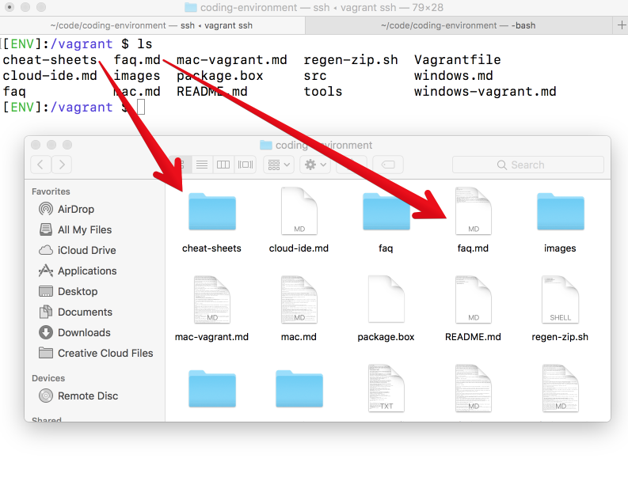
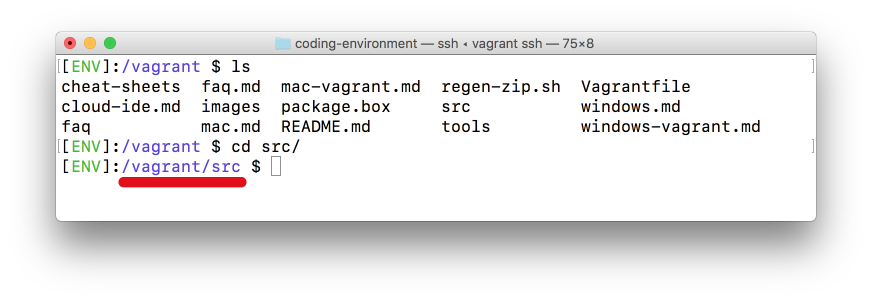

# Vagrant on Apple Macintosh Computers

## Explore Terminal Navigation in Vagrant

In order to understand how to use your vagrant environment, explore how to use the terminal a bit more by reviewing some of the commands you just used to set up your web development environment. The `cd` command means _change directory._ It puts you in the directory you type after it; in the following example, it puts you in the `/vagrant` directory.

```
$ cd /vagrant
```

The `ls` command means _list._ It lists all the files and folders in the current directory

```
$ ls
```

When you type `ls` and press **Enter**, the terminal shows a list of all the folders and files in the `/vagrant` folder. This is equivalent to opening the `/vagrant` folder in Mac Finder and viewing its contents, as you can see in the following image:



Right now, you're in the `/vagrant` directory. If you want to change the directory (i.e., move into a different folder), you can again use `cd`. Let's move into the `/src` directory:

```
$ cd src
```

Now run the `ls` command to see everything inside `/src`:

```
$ ls
```

You should see one directory listed out named `/rails-test-app`. The `/rails-test-app` directory contains an app that was setup during the installation process to test that your system is working properly. 

If you ever get lost in the terminal, look between the `[ENV]`: and the `$` to see which directory you are in. Right now, because you changed the directory to `/src`, you should see the following:



To navigate back to the directory above the one you're currently in (i.e., its parent directory), run the following command:

```
$ cd ..
```

In this case, if you type `cd ..` and press the **Enter** key, you can type `ls` again to see that you're now outside of the `/src` folder.

## Controlling Your Environment

You control your vagrant environment using the terminal. First you'll need to launch the terminal by going into your finder, then choose Applications > Utilities, and open up the Terminal application.

Next you should navigate into your vagrant folder by running the following command in your terminal (without the dollar sign):

```
$ cd ~/Desktop/coding-environment
```

> **Note**: make sure that the `coding-environment` folder is actually on your desktop, otherwise this won't work.

Now you're ready to run commands and control your environment (without doing this step none of the other steps in this guide will work).

## Turning on your Environment

In your terminal run the following command (without the dollar sign) to start your virtual computer:

```
$ vagrant up
```

This will take a few moments to complete, it may give you a yellow warning about guest additions (but it won't give an error messages). Once you're ready it should look like this:


Once you turn on your environment it will be running until you shut it down (or restart your machine).

## Connecting to your Environment
To log into your web-dev environment follow the following steps:

**First**, after `vagrant up` finishes, in the terminal type:

```
$ vagrant ssh
```

**Second**, then you'll be prompted with a terminal window inside your web development environment that looks like this:

 **This brings you into your web dev environment ready to run commands.**


Now you're ready to do web development and run all the commands to build awesome web applications

## Shutting Down Your Environment

Sometimes you may want to turn off your web dev environment (see below for examples). To do this make sure you've set up a terminal window as outlined above in **Controlling Your Environment**, then run this command in your normal terminal window (don't copy the dollar sign).

```
$ vagrant halt
```

## Vagrant Trouble Shooting

**_Here's what to do if you see weird errors while dealing with your web dev environment after you've been using it normally for a while._**

**Trouble Shooting Environment Issues** — sometimes your virtual computer won't work anymore. This is mostly due to two reasons:

* Your computer went to sleep or hibernated
* You disconnected from one WiFi provider and connected to a different one

If this happened and you can restart your virtual computer by running through the following steps (see above):

* [Shutting Down Your Environment](https://github.com/university-bootcamp/coding-environment/blob/master/cheat-sheets/vagrant-intro-mac.md#shutting-down-your-environment)
* [Turning on your Environment](https://github.com/university-bootcamp/coding-environment/blob/master/cheat-sheets/vagrant-intro-mac.md#turning-on-your-environment)
* [Connecting to your Environment](https://github.com/university-bootcamp/coding-environment/blob/master/cheat-sheets/vagrant-intro-mac.md#connecting-to-your-environment)

**Failing to Start Your Ruby Server** — if you can't start or shut down your ruby server you may see an error that looks like the following:

```
A server is already running. Check /vagrant/src/your-app-name-here/tmp/pids/server.pid.
Exiting
```

If you see this error message you'll need to use a terminal window inside your web dev environment to navigate into your web application project folder and run the following command: 

```
$ kill `cat tmp/pids/server.pid`
```
