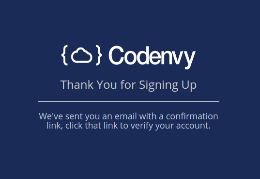
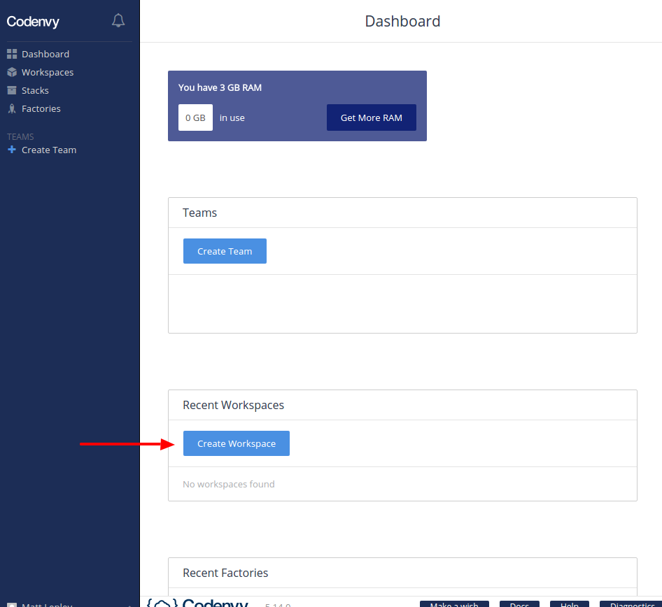
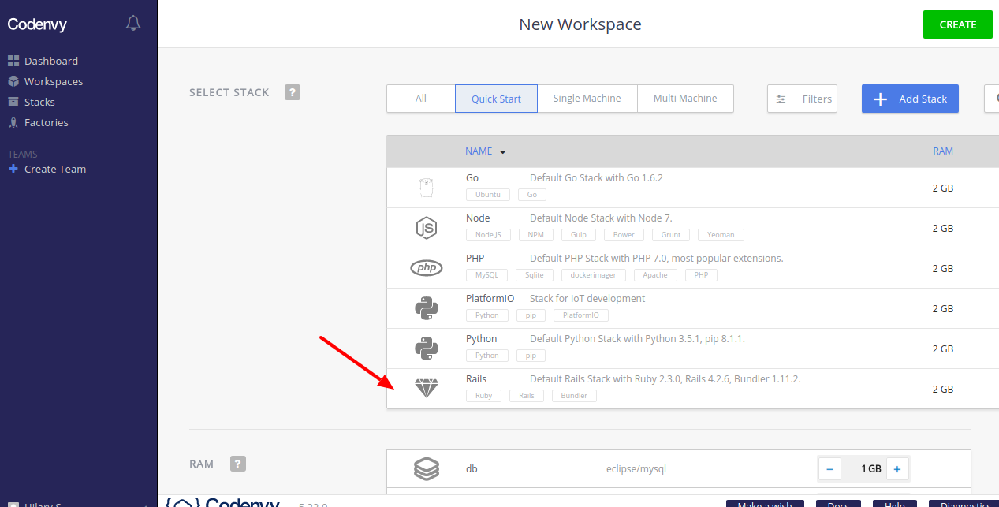
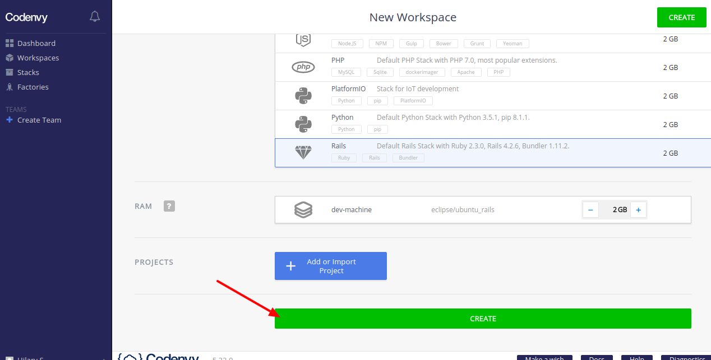
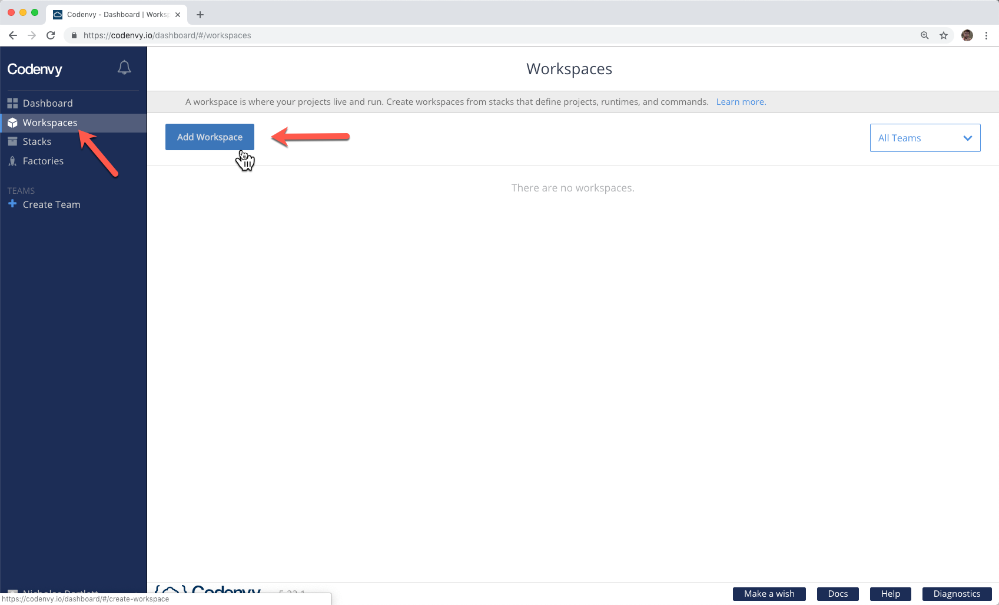

# Cloud IDE

Instead of installing the programs on our personal computers, we can use a (Cloud IDE). 

While there are many options, we recommend starting with Codenvy; it has much of what is needed set up already. Cloud IDEs allow us to run a full-fledged coding environment inside our web browser. The setup is quick and straightforward, which makes using a cloud IDE a no-brainer at this stage of the game.

1. [Setting up Codenvy](#setting-up-codenvy)
2. [Using Codenvy](#using-codenvy)
   - [The Terminal](#the-terminal)
   - [File Explorer Pane](#file-explorer-pane)
   - [Edit File Pane](#edit-file-pane)
3. [Alternatives](#alternatives)

Codenvy has two main concepts we'll be using: stacks and workspaces.

- <span id="stacks">**Stacks**</span> define what programming languages, programs, and commands should be available on the "machine" your workspace is running on. Setting up a stack is the equivalent of making a list of software you need to install on your laptop.

- <span id="workspaces">**Workspaces**</span> are created from stacks and are where your projects live and run. You can think of them as an instantiation (manifestation) of a stack - a folder and work area where all of your needed programs are installed and set up, in which you can create files, run projects, and more.

## Setting up Codenvy

To get set up on Codenvy, we'll need to do three things: set up our account, create a <a href="#stacks">stack</a> with all of the software we'll need, and then create a <a href="#workspaces">workspace</a>. Follow the following steps to get set up:

1. Navigate to <https://codenvy.io/site/login>  and click **Create One** to set up an account. 

   

2. Enter your email address and a username, and then click **Create Account**.

   

3. Close the confirmation page.

   

4. Click the **Verify Email** button in the email sent to the address you entered in step 2.

    

5. Finish setting up your account by entering the requested information. Click **Get Started**.

   

6. Click **Stacks** in the left navigation, and then click **Build Stack From Recipe**.

   

7. Paste `FROM tteltrab/rr-pg-for-codenvy` into the box, and click **OK**.

   

8. Name your stack `bootcamp`, give it a description, and click **Save**

   

   - This stack includes setup for ruby, rails, postgres, and  node.js

9. Next, click **Workspaces** in the left navigation, and click **Add Workspace**.

   

10. Scroll down and select **bootcamp** (this is what we named our stack in the earlier step). Then click **Create**.
   

11. The application should redirect you to a loading page; it will take a couple to load the workspace and set it up. 
   

12. When the loading is complete, you should see the editor environment:
   

The coding environment is ready for you to start working!

## Using Codenvy

Now that you have your environment set up let's talk about how it works.

The coding environment has three primary components: the terminal, the File Explorer pane, and the Edit File pane. These different parts are connected and work together.

### The Terminal

At the bottom of the coding environment, you'll see the terminal. The terminal includes a dollar sign and colored text just to the left of it, and it will echo any commands you type.

Let’s try running the command to display the date on the screen.

First, click the terminal section and type the word `date` and then press the **Enter** or **Return** (depending on your keyboard). The screenshot below shows the exact command to run.

```sh
$ date
```

> Note:  We’ve included the dollar sign in the command above. We use the dollar sign in the instructions to indicate that you should enter the command into the terminal. The dollar sign we show you maps to the dollar sign that the terminal shows automatically. We will consistently follow this pattern. _Do not copy and paste the dollar sign into the terminal_.

The date will be displayed to you. The new dollar sign that is displayed indicates that the terminal is ready for more commands:


### File Explorer Pane

On the left-hand side of the IDE, you'll see the File Explorer pane. This pane allows you to view the structure of the various folders and files in your coding environment. 


You can import existing projects, create your own from scratch, or use a template. If you have no files, you can create them manually or use a template. 

- To use a template, click **Create Project...**, select the **web-rails-simple** example, name your project, and click **Create**:

  

The folder icon indicates andy type of folder, while extension-specific icons represent individual files.

- Double-click on a folder:

  

- The contents of the file will populate the pane to the right:

  

### Edit File Pane

The Edit File pane shows the contents of a file and allows you to edit it. Changes to files are saved automatically. See the description of the coding environment below.

  

By clicking in the Edit File pane, you can adjust the contents of a file. To save the changes, you can hold **command+S** (**CTRL+S** for Windows), or go to the top menu and click **File > Save**.

We'll be using this coding environment extensively. In the next lesson, we'll cover how to interact with the coding environment as well as some of the most important commands within the coding environment. 

## Alternatives 

Another option is to use [AWS Cloud 9](https://aws.amazon.com/cloud9/), which has a free tier but requires you to sign up with AWS with a credit card (and charges you automatically if you go beyond your free tier).

Similarly to above, you sign up and get an in-browser editor. With Cloud 9, Ruby and Rails are already set up and available in the default workspace.
