# Cloud IDE

Instead of installing the programs on our personal computers, we can use a Cloud IDE.

While there are many options, we recommend starting with Cloud9; it has much of what is needed set up already. Cloud IDEs allow us to run a full-fledged coding environment inside our web browser. The setup is quick and straightforward, which makes using a cloud IDE a no-brainer at this stage of the game.

[AWS Cloud 9](https://aws.amazon.com/cloud9/) has a free tier but requires you to sign up with AWS with a credit card (and charges you automatically if you go beyond your free tier).

Once you're signed up, you should be presented with some steps for creating a new environment. The first step should ask you for a name, use "Class" for this:

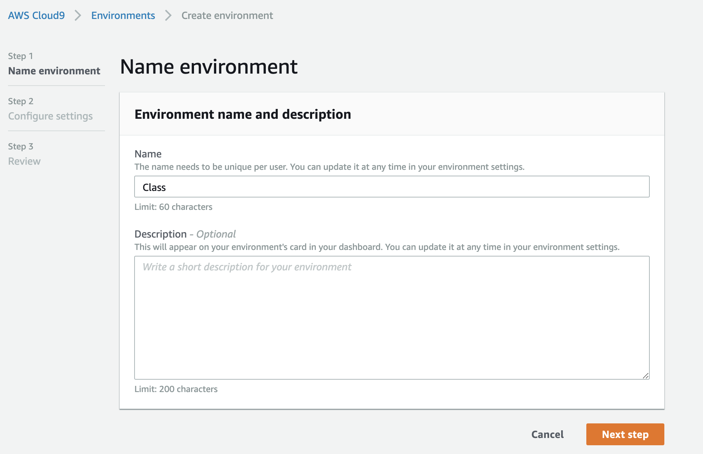

At the next step you should be presenting with other options for configuring your Cloud9 IDE. Leave the default settings and make sure to sign up for the free tier.

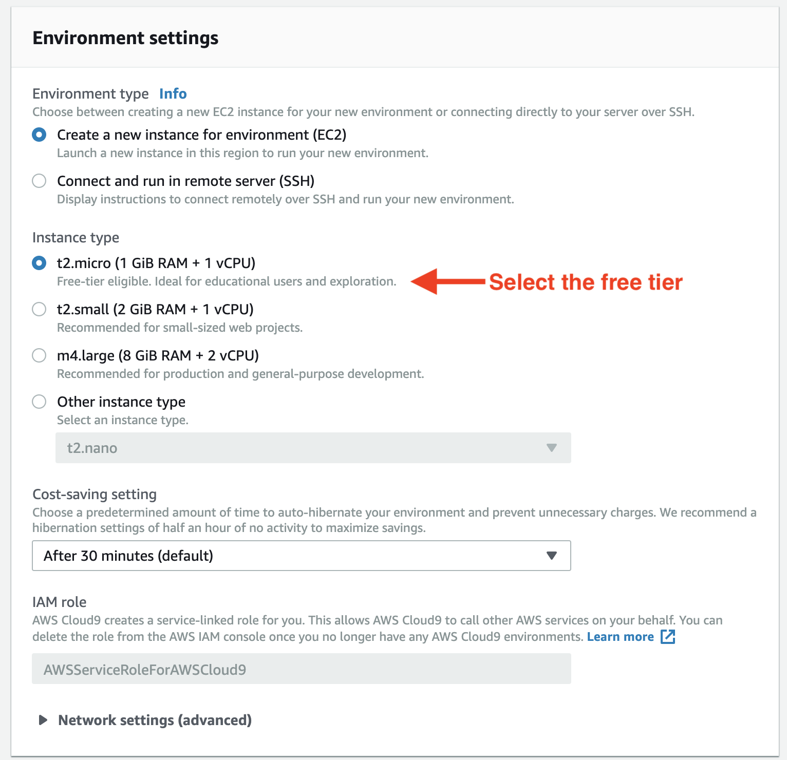

Once your environment is created, you should be brought to a screen that looks similar to the following:

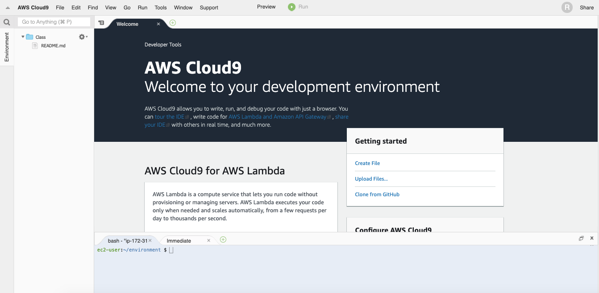

From this environment you'll have an in-browser editor you'll use for all of your coursework. Working in the Cloud9 environment, you'll have almost all of the tools you'll need for the entire program already installed.

You'll just need to run a few commands from within the terminal to install Postgres, a database we'll be using throughout the program. You'll find the terminal at the bottom of your editor.

Copy and paste the following command in your Cloud9IDE terminal and hit ENTER:

```
sudo yum install postgresql postgresql-server postgresql-devel postgresql-contrib postgresql-docs
```

At one point during the download you will be given a prompt asking if you'd like to proceed with the download. Type `y` and hit ENTER to continue.

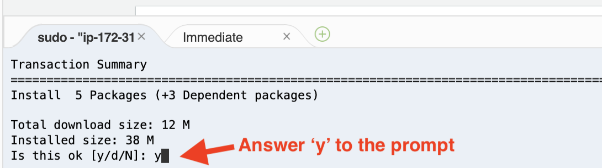

Then, once the download completes, paste the following command into your terminal and hit ENTER.

```
sudo service postgresql initdb
```

Then, paste the following into your console and hit ENTER.

```
sudo service postgresql start
```

Once that completes, paste the following into your console and hit ENTER.

```
echo 'sudo service postgresql start' | sudo tee -a /etc/rc.d/rc.local
```

Then, paste the following into your console and hit ENTER. You may see something printed about not being able to connect to a directory, ignore this.

```
sudo -u postgres createuser -s ec2-user
```

Then, paste the following into your console and hit ENTER. You may see something printed about not being able to connect to a directory, ignore this.

```
sudo -u postgres createdb ec2-user
```

Then paste the following command into your terminal and hit ENTER.

```
sudo su postgres
```

Then paste the following command into your terminal and hit ENTER.

```
psql
```

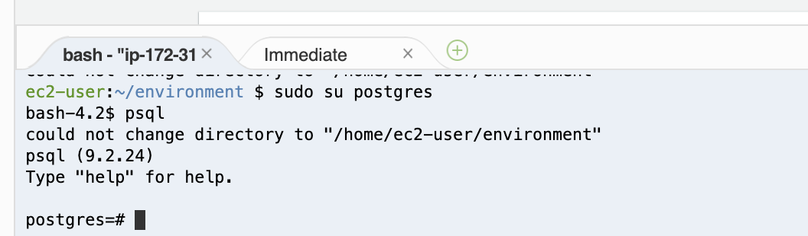

At this point your terminal should change.

Paste the following and hit ENTER.

```
\password
```

Here you should be prompted for a password. Leave this space blank and hit ENTER, and then hit ENTER again to confirm.

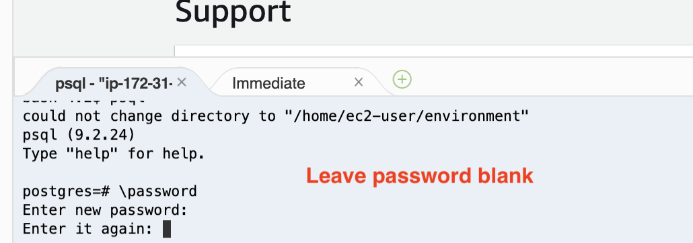

Then, paste the following into your terminal and hit ENTER.

```
\quit
```

Then, paste the following into your terminal and hit ENTER.

```
exit
```

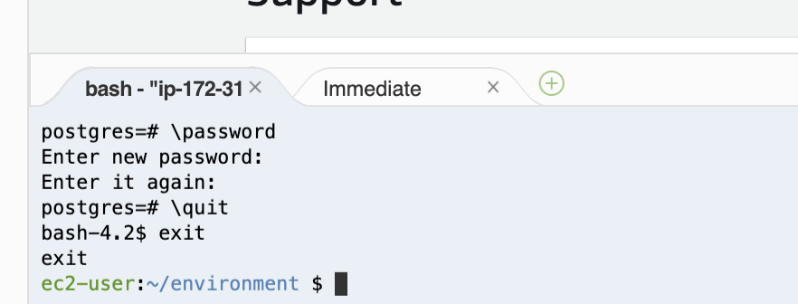

Once completed, we'll create a rails test application to make sure everything is working properly.

Run the following command in your Cloud9 terminal:

```
rails new rails-test-app -d postgresql
```

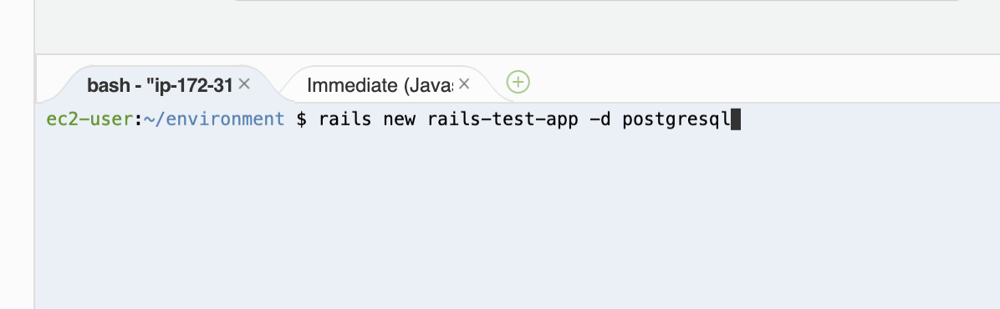

This command may take a few minutes to run. Once it completes, you should see a `rails-test-app` in your environment sidebar.

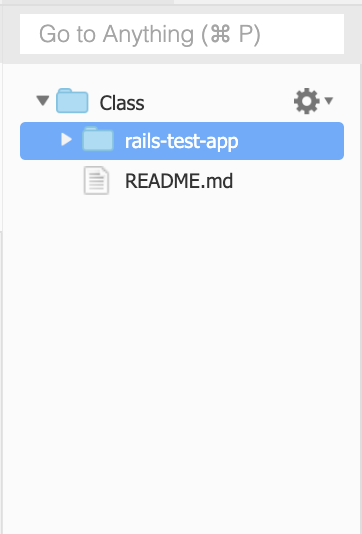

In your terminal run the following command:

`cd rails-test-app`

This should change your terminal's present working directory to the `rails-test-app` folder:

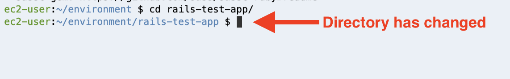

Once you've changed directories, run the following two commands separately to setup your test application's Postgres database.

```
rails db:setup
```

```
rails db:migrate
```

Now you should be able to start your rails server by running the following command in your terminal:

```
rails s
```

You should see something similar appear on your screen:

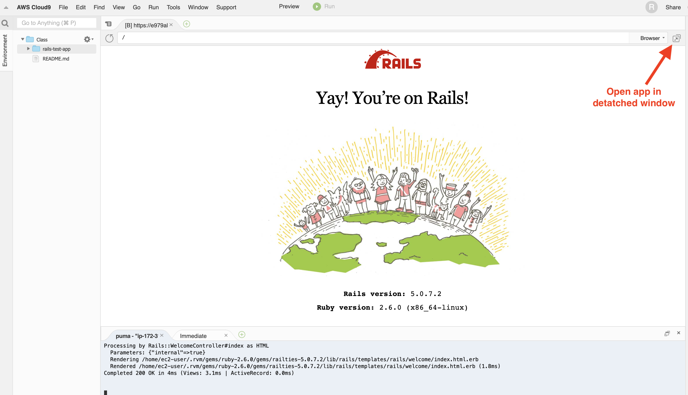

If you don't automatically see "Yay! You're on Rails!" displayed, click the "Preview" tab at the top of the screen and select the "Preview Running Application" option to bring this up.

It isn't ideal to have your application running in the same window as your editor, so you can click the icon to the right of the address bar to open the application in a new detached window separate from the editor.

If you were able to successfully  get your rails app up and running, you successfully set up Cloud9 IDE. If you weren't able to get this far, review the previous instructions.
