# Cloud IDE

Instead of installing the programs on our personal computers, we can use a Cloud IDE.

While there are many options, we recommend starting with Codenvy; it has much of what is needed set up already. Cloud IDEs allow us to run a full-fledged coding environment inside our web browser. The setup is quick and straightforward, which makes using a cloud IDE a no-brainer at this stage of the game.

- [Setting up Codenvy](#setting-up-codenvy)
  - [Step 1: Setting up your Account](#step-1-setting-up-your-account)
  - [Step 2: Creating the "Stack"](#step-2-creating-the-stack)
  - [Step 3: Creating the "Workspace"](#step-3-creating-the-workspace)
- [Using Codenvy](#using-codenvy)
  - [The Terminal](#the-terminal)
  - [File Explorer Pane](#file-explorer-pane)
  - [Edit File Pane](#edit-file-pane)
- [Setting Up Projects](#setting-up-projects)
  - [Step 1: Creating the App](#step-1-creating-the-app)
  - [Step 2: Setting up the Database (Postgres)](#step-2-setting-up-the-database-postgres)
  - [Step 3: Setting up the Run Command](#step-3-setting-up-the-run-command)
- [Alternatives](#alternatives)

The important terms we'll be using with Codenvy to understand before we get started: 

 - **stacks** define your environment requirements (e.g. you will need ruby)
 - **workspaces** are your environment (e.g. a created machine with ruby installed)
 - **projects** are folders of code, the applications themselves (e.g. a ruby on rails web application you've built)

## Setting up Codenvy

To get your coding environment set up on Codenvy, we'll need to do three things: set up our account, create a <a href="#stacks">stack</a> with all of the software we'll need, and then create a <a href="#workspaces">workspace</a>. Once the environment is set up, you'll want to [set up a project](#setting-up-projects).

Follow these steps to get the environment set up.

### Step 1: Setting up your Account

1. Navigate to <https://codenvy.io/site/login> and click **Create One** to set up an account. 

   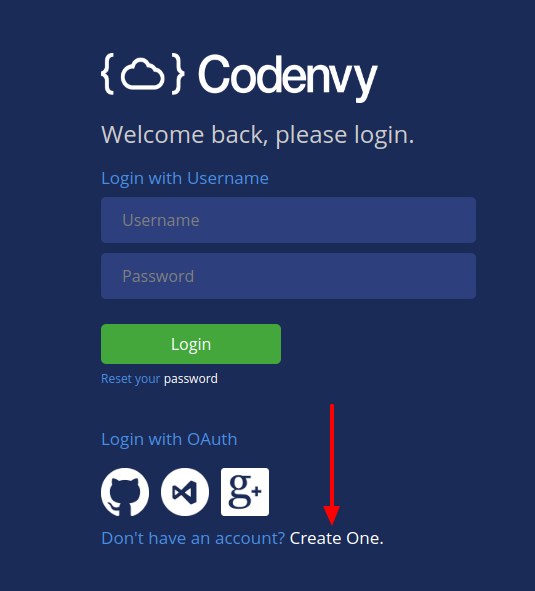

2. Enter your email address and a username, and then click **Create Account**.

   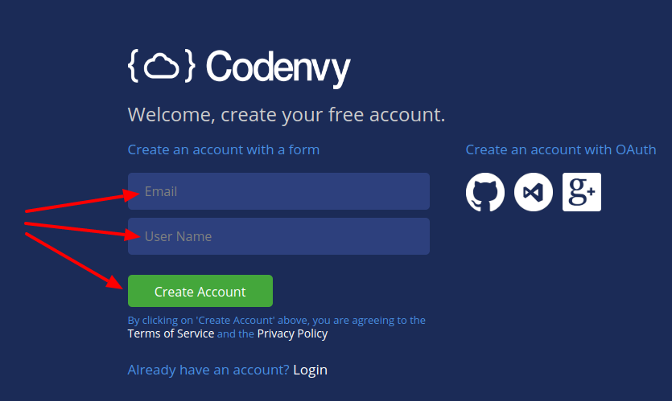

3. Close the confirmation page.

   

4. Click the **Verify Email** button in the email sent to the address you entered above.

   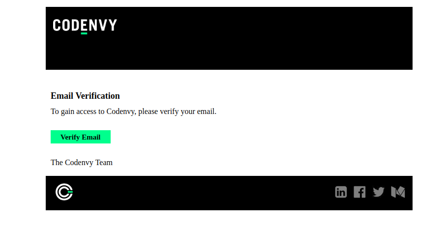

5. Finish setting up your account by entering the requested information. Click **Get Started**.

   

### Step 2: Creating the "Stack"

<span id="stacks">**Stacks**</span> define what programming languages, programs, and commands should be available on the "machine" your workspace is running on. Setting up a stack is the equivalent of making a list of software you need to install on your laptop.

Follow these steps to set up the stack we'll be using:

1. Click **Stacks** in the left navigation, and then click **Build Stack From Recipe**.

   

2. In the text field enter the following code:
  
    ```docker
    FROM trilogyed/codenvy
    ``` 
    
   Then click the **OK** button:

   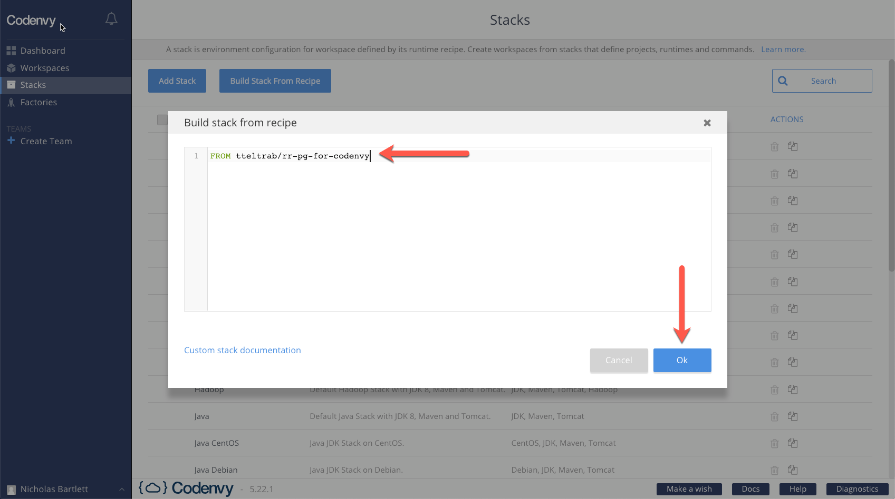

3. Enter a name for your stack, but keep in mind that it needs to be unique. Our suggestion is to use the format of `bootcamp-YOUR-NAME` and replace `YOUR-NAME` with your name, but you can give it any name so long as you reference this name you've chosen in the next step. Then enter a description, and click **Save**.

   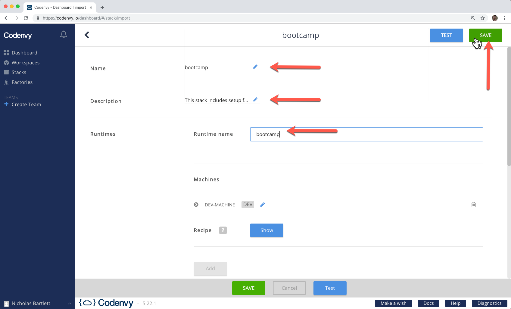

   - Example description: 

     `This stack includes setup for ruby, rails, postgres, and node.js`

### Step 3: Creating the "Workspace"

<span id="workspaces">**Workspaces**</span> are created from stacks and are where your projects live and run. You can think of them as an instantiation (manifestation) of a stack - a folder and work area where all of your needed programs are installed and set up, in which you can create files, run projects, and more.

Follow these steps to set up your workspace:

1. Next, click **Workspaces** in the left navigation, and click **Add Workspace**.

   

2.  Scroll down and select **bootcamp-YOUR-NAME** (this is what we named our stack in the earlier step). Then click **Create**.
   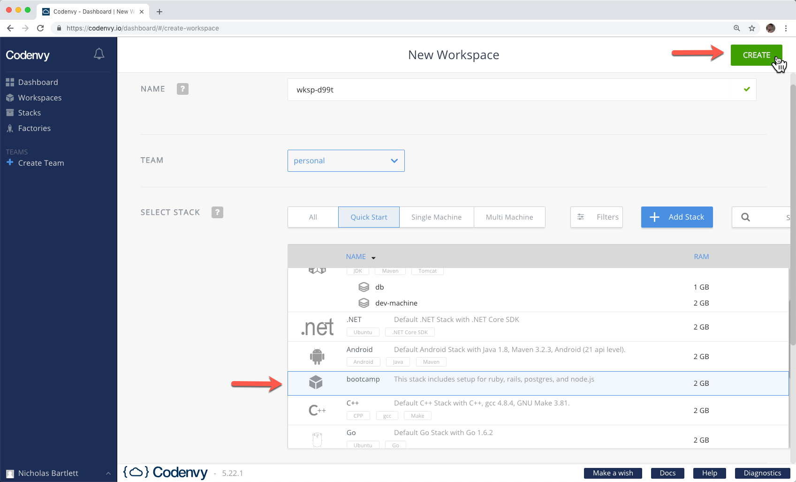

3. The application should redirect you to a loading page; it will take a couple to load the workspace and set it up. 
   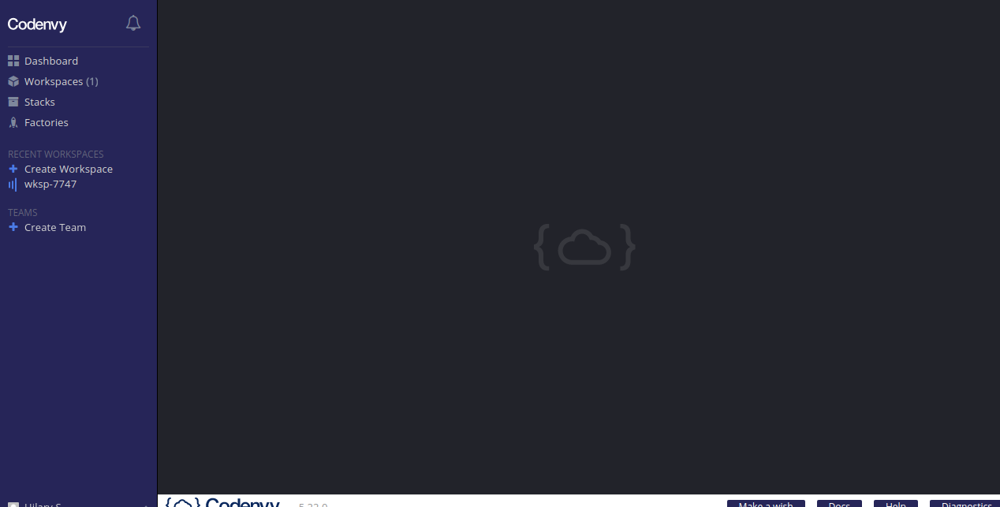

4. When the loading is complete, you should see the editor environment:
   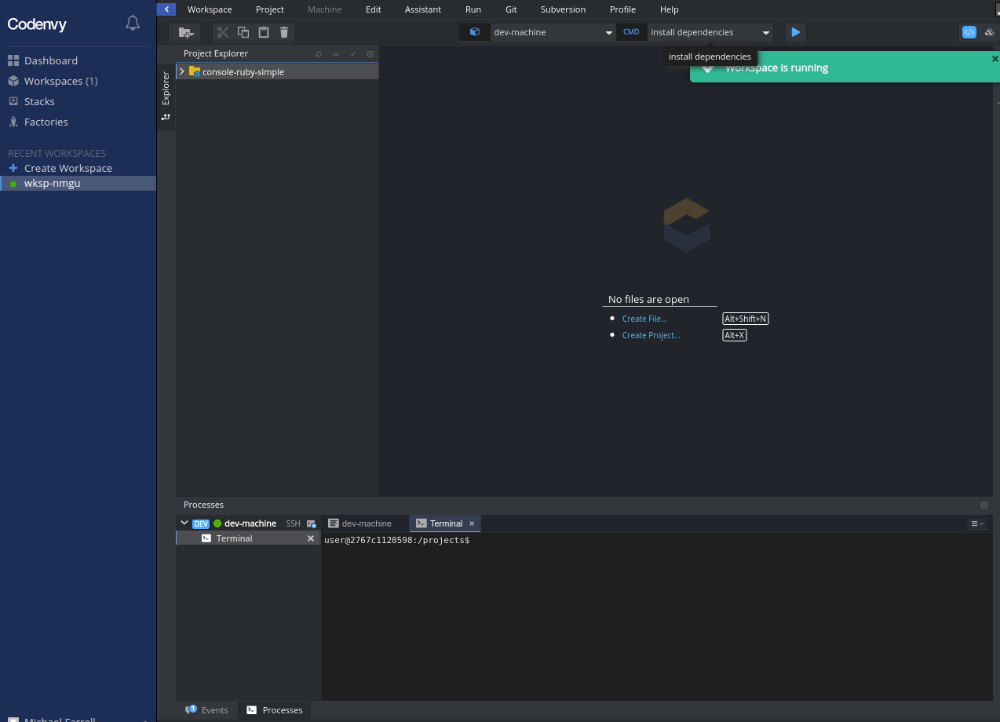

The coding environment is ready for you to start working! The next section breaks down the UI, and the section after that gets you up and running with your first application!

**As a final step, follow the [account setup guide](account-setup.md) to hook up your workspace to your GitHub and heroku accounts.**

> <span id="workspace-note">Note</span>: Codenvy takes a "snapshot" of your workspace when it stops, and when you return starts it back up at the state in which you left it. This keeps your work from getting lost, but doesn't preserve any running services. Thus, you will need to run the postgres service when starting your workspace ( `service postgresql start`).

## Using Codenvy

Now that you have your workspace set up let's talk about the capabilities of the UI.

The coding environment has three primary components: the terminal, the File Explorer pane, and the Edit File pane. These different parts are connected and work together.

### The Terminal

At the bottom of the coding environment, you'll see the terminal. The terminal includes a dollar sign and colored text just to the left of it, and it will echo any commands you type.

Let’s try running the command to display the date on the screen.

First, click the terminal section and type the word `date` and then press the **Enter** or **Return** (depending on your keyboard). The screenshot below shows the exact command to run.

```sh
$ date
```

> Note:  We’ve included the dollar sign in the command above. We use the dollar sign in the instructions to indicate that you should enter the command into the terminal. The dollar sign we show you maps to the dollar sign that the terminal shows automatically. We will consistently follow this pattern. _Do not copy and paste the dollar sign into the terminal_.

The date will be displayed to you. The new dollar sign that is displayed indicates that the terminal is ready for more commands:

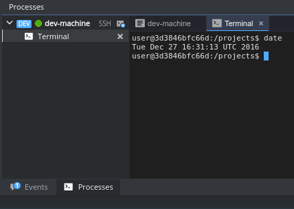

This pane will also show running processes (e.g. your running rails process).

### File Explorer Pane

On the left-hand side of the IDE, you'll see the File Explorer pane. This pane allows you to view the structure of the various folders and files in your coding environment. 

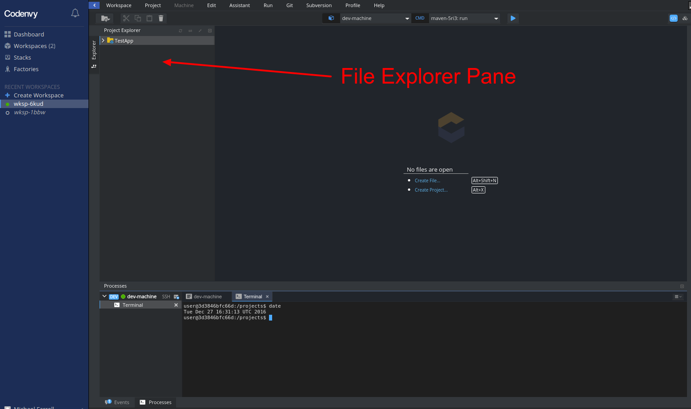

You can import existing projects, create your own from scratch, or use a template. If you have no files, you can create them manually or use a template. 

- To use a template, click **Create Project...**, select the **web-rails-simple** example, name your project, and click **Create**:

  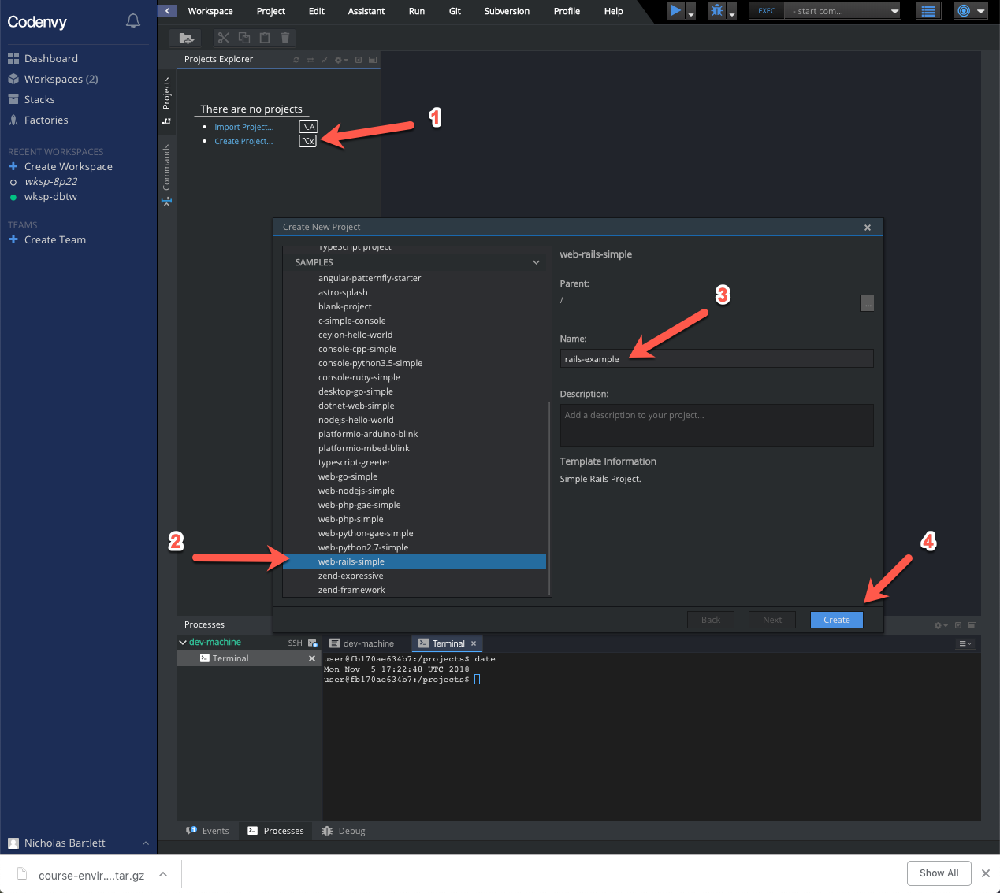

The folder icon indicates andy type of folder, while extension-specific icons represent individual files.

- Double-click on a folder:

  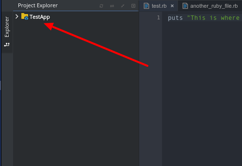

- The contents of the file will populate the pane to the right:

  

### Edit File Pane

The Edit File pane shows the contents of a file and allows you to edit it. Changes to files are saved automatically. See the description of the coding environment below.

  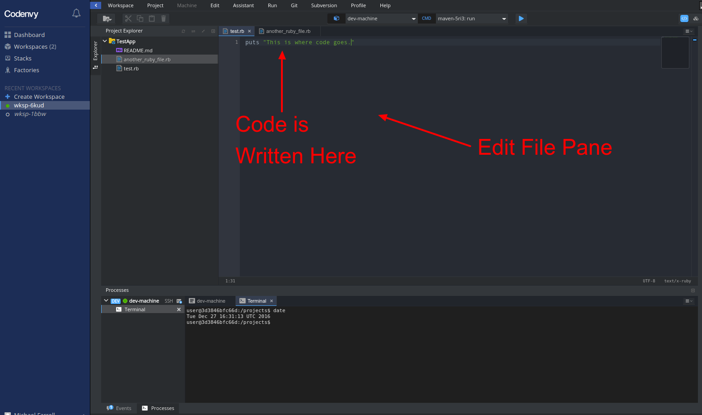

By clicking in the Edit File pane, you can adjust the contents of a file. To save the changes, you can hold **command+S** (**CTRL+S** for Windows), or go to the top menu and click **File > Save**.

We'll be using this coding environment extensively. In the next lesson, we'll cover how to interact with the coding environment as well as some of the most important commands within the coding environment. 

## Setting Up Projects

In this section, we'll walk through setting up an example application.

> Note: These concepts apply to all projects we will be creating (and almost all of this you would have to do as part of the project setup even if you _weren't_ using a cloud IDE).

Follow these steps to set up the project, using [the terminal](#the-terminal) and the [the edit file pane](#edit-file-pane) provided in the browser:

### Step 1: Creating the App

We can use `rails new` to create the new app, though we'll need to make sure we create the app in the right folder.

1. For us to be able to see the code in the editor, we'll need to be in projects folder any time we create a project. In the terminal, type the following: 
    ```sh
    cd projects
    ```

2. We can create a new rails app, install dependencies (done as part of `rails new`), and move into our new project folder using the following commands:
   ```sh
   rails new rails-test-app -d postgresql
   cd rails-test-app
   ```
 
### Step 2: Setting up the Database (Postgres)

Next, we need to set up our application to use postgres:

1. Ensure postgres is running:
    ```sh
    service postgresql start
    ```
2. Open up the `config/database.yml` file in your editor and change it so that it looks exactly like the below: 
    ```yml
    default: &default
      adapter: postgresql
      encoding: unicode
      pool: <%= ENV.fetch("RAILS_MAX_THREADS") { 5 } %>
      username: postgres
      password: password
      host: localhost

    development:
      <<: *default
      database: test_development

    test:
      <<: *default
      database: test_test

    production:
      <<: *default
      database: test_production
      # username: test
      # password: <%= ENV['TEST_DATABASE_PASSWORD'] %>
    ```
    > Note: These files are whitespace-sensitive; be sure the file has the same amount of whitespace as the above text.

3. Set up the application database:
    ```sh
    rake db:create
    ```

### Step 3: Setting up the Run Command

Finally, we need to create a new run command so that we can run the application and preview the live URL. We can do this through the UI:

1. Create a new run command by selecting the **Commands** tab, clicking the **+** icon next to **RUN**, and double-clicking **Custom**:

   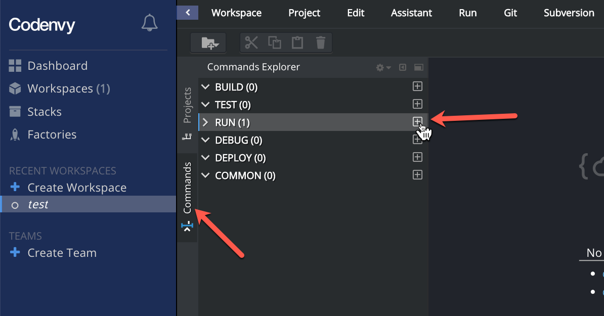

   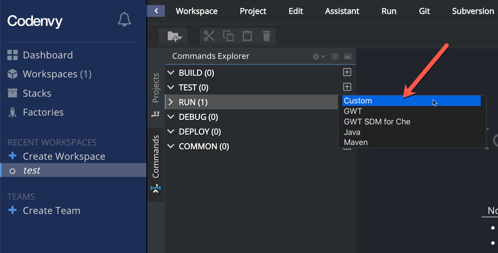

2. Enter the following configuration information for the run command you're creating:

   - Name: 
      ```
      rails-custom
      ```
   - Command Line:
      ```sh
      cd ${current.project.path} && rails server -b 0.0.0.0
      ```
   - Preview URL:
      ```
      http://${server.port.3000}
      ```
  
   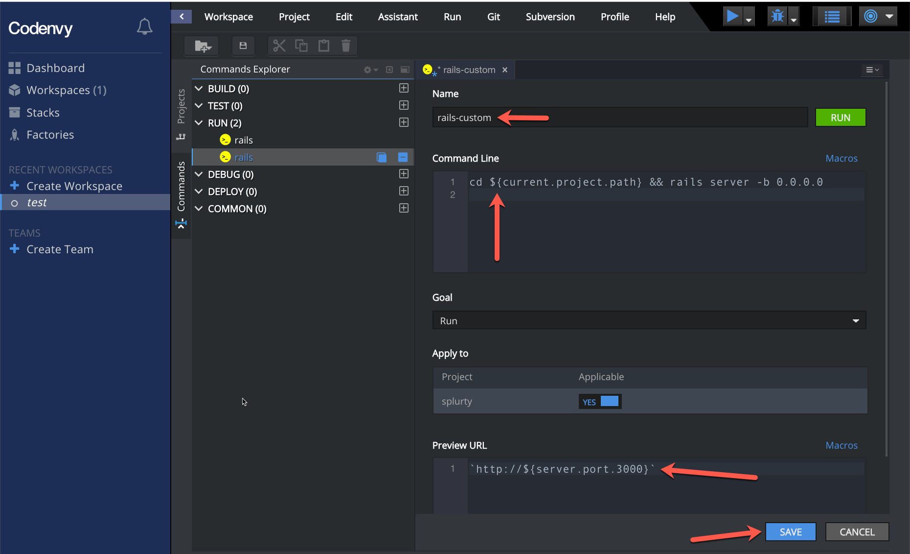

3. Click the **Save** button.

4. Run the process by clicking the down-arrow next to the play button and choosing the desired configuration:

   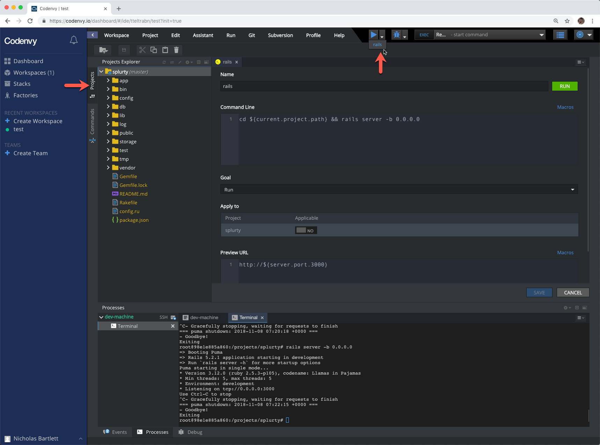

5. Find the live URL in the process pane:

   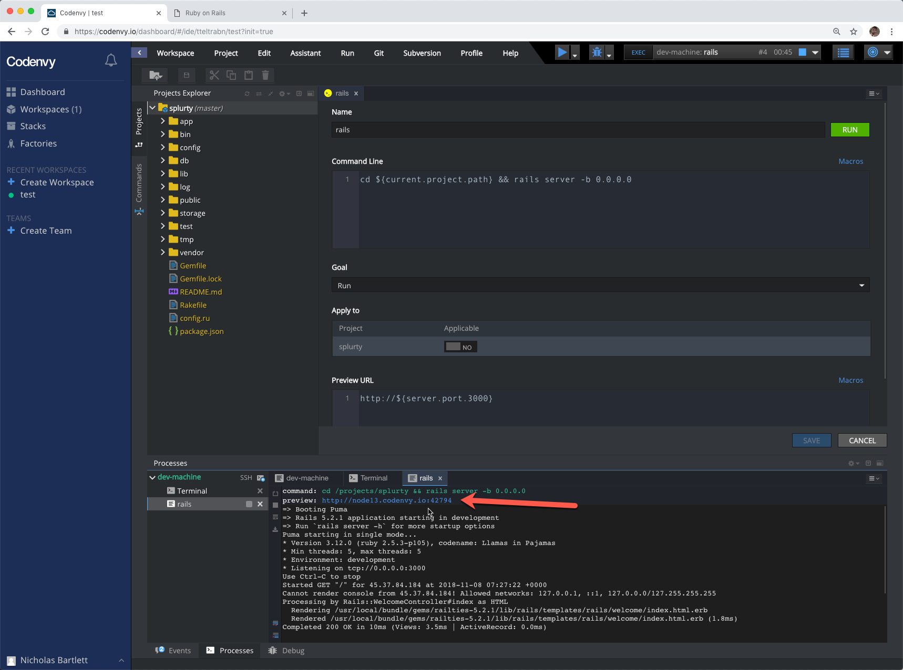

6. Click the link to see the resulting application!

   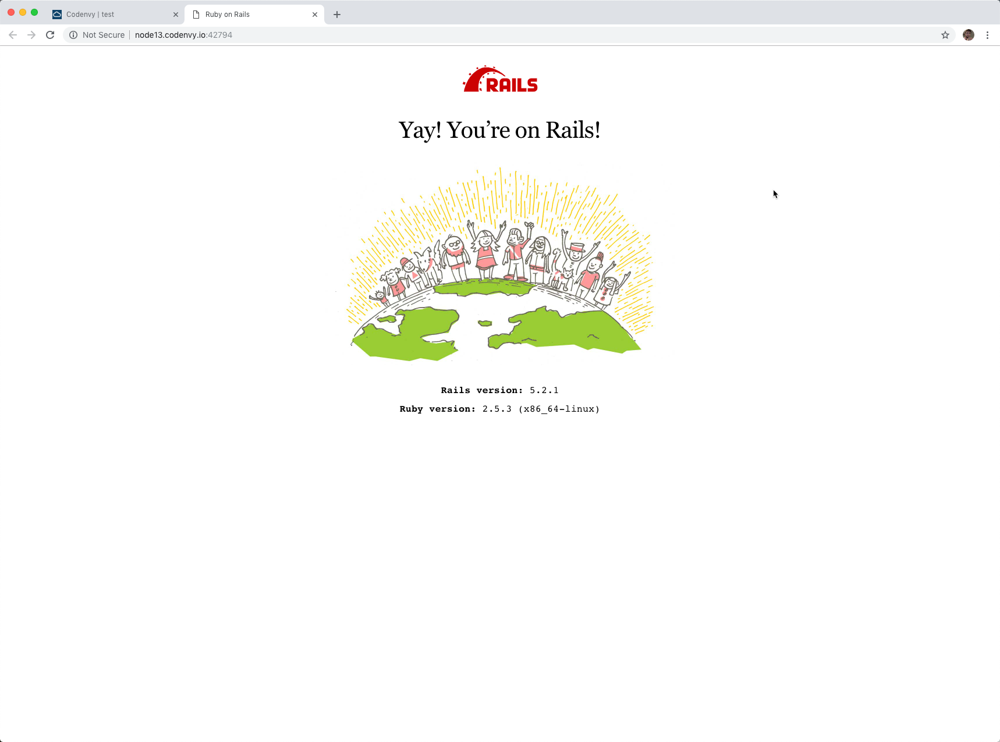

Congratulations, your application is now up and running!

If you want to stop your running application, simply close the rails process in the terminal/process pane.

> Note: Remember <a href="#workspace-note">this note regarding how your workspace will reset after it has been stopped</a>. Also remember to re-navigate into your project using `cd projects/<your-project-folder>`, where `<your-project-folder>` should be replaced by the name of your project folder.
