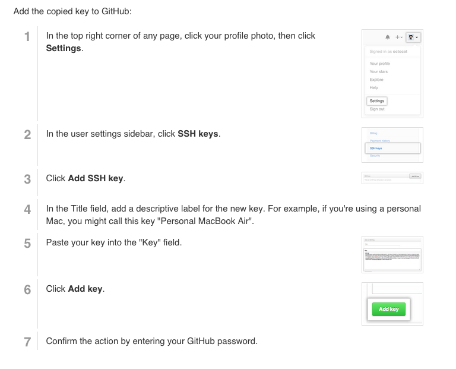

# Setting up a Cloud9 Development Environment

Cloud9 is a cloud-based development IDE brought to you by Amazon web services (AWS).  You can use your AWS account to create this web based IDE.

## Step 1 — Log into your AWS Account.

Sign in to your [AWS account](https://aws.amazon.com/) and visit the [AWS Management Console](https://console.aws.amazon.com/).

## Step 2 — Create a new Cloud9 Environment

**First**, in the AWS management console, scroll down and find the option for **Cloud9**, listed under **Developer Tools**.  Click this link.


**Second**, in the page that opens, click the orange button that suggest **Create Environment**.


**Third**, in the options that are shown enter a name.

| field | value |
|---|---|
| Name | coding-environment |

Then click the orange **Next step** button.


**Fourth**, leave the default fields selected and click the orange **Next step** button.


**Fifth**, Amazon will show you the prompts of what is being created for you to confirm that it works.  Scroll to the bottom and click the orange **Create environment** button.


**Sixth**, wait for your environment to finish being created.  You will be prompted to wait for the process to finish.


When the page finishes loading it will take you to your Cloud9 IDE.  Now that your environment is created you will be able to configure your coding environment.

## Step 2 — Update Your Cloud9 Environment

Your Cloud9 Environment will be up and running, but you will need to install a few programs in the environment to get it to work.

### Update Node

Run the following command to update your NodeJS programming environment.

```
nvm install node
```

### Install Heroku

Run the following command in your Cloud9 terminal to install the heroku command line interface.

```
npm install -g heroku
```


### Install and Configure Your Postgres Database

If you’re learning how to build web applications, the most common way to get it "live on the internet"— for example, to get a link so you can share it with other people— is to do it through heroku.com. Most likely, you’ll be using Heroku for your first apps, too.

Heroku uses a the _postgres_ database. Because of this, getting Postgres installed and running in our environment is a good idea.

Running the same database as Heroku in our coding environment is generally considered a good idea. Many tutorials will have you use a different database when you’re coding on your own machine versus when it’s live on the internet. This is generally because it’s a bit easier to set up, but it’s a bad idea in the long run.

Using the same database across both generally makes it easier to do and this is called parity with a dev environment. Developers generally agree that it’s a good thing. Even though it can be kind of a pain now, let’s be responsible and set up Postgres to save us pain in the future.

**First**, run the following command to install the Postgres program inside your Cloud9 environment.  To do this, run the following command in your terminal window.

```
sudo yum install postgresql postgresql-server postgresql-devel postgresql-contrib postgresql-docs
```

You might be prompted if you want to continue in the installation process.  If this happens click `Y` to continue the install process for these programs.

**Second**, run the following command to initialize your postgres database.

```
sudo service postgresql initdb
```

**Third**, run the following command.  This command will download and execute a small script that will configure your postgres database to work as expected.

```
curl https://gist.githubusercontent.com/kenmazaika/07614a1a926351b2cc9f215202524067/raw/e89543ea9fe94f00bdf3ae219b5f3218b323f279/cloud9-postgres-setup.sh | sh
```


### Step 3A: Generate SSH Key

An `SSH key` is a password file that exists on your computer.  First, we will need to generate a password file for our environment to use and we will do that in this section.  In the next part, we'll use this password file with our accounts.

> **Note:** The command that we are suggesting to run includes the backtick character, ```.  This is a different character than the single quote character, `'`.
> 
> Either copy and paste the command below, or if you type it use the correct backtick character.  Usually, you can find this character on your keyboard on the key to the left of the 1 button.

This first command will run the command to turn on the SSH program in your environment.

*First*, run the following command in your coding environment's terminal prompt.

```
eval `ssh-agent -s`
```

After the SSH agent begins running, run the following command to generate an SSH key (a password file) inside your coding environment.

**Next**, copy and paste the following command into your coding environment's terminal prompt.


```
ssh-keygen -t rsa -C "Vagrant" -N '' -f ~/.ssh/id_rsa
```

This file that was created needs to be registered on your computer.

**Finally**, copy and paste the following command into your coding environment's terminal prompt.

```
ssh-add ~/.ssh/id_rsa
```

This is everything you need to do to generate new SSH keys and have them setup in your coding environment.  Now we can use these SSH keys with the accounts you created.


UNTESTED


### Step 3B: Configure heroku with SSH key

First, you will need to log into our heroku account in this coding environment.

> The next command will prompt you for the email address and password that you used when setting up your heroku account.

**Next**, run the following command and enter your email address and heroku password when prompted for it.

```
heroku login
```

This step logs your computer into your heroku account.  Connecting your heroku account with your SSH keys will make it so you won't have to manually log into heroku in the future when using it.

**Finally**, add your ssh key to your heroku account by running the following command in your coding enviroment.

```
heroku keys:add
```

_Running the above command may prompt you with the question `Would you like to upload it to Heroku`.  If it does, enter `Y`.


This step will finalize the connection between your coding environment and the heroku service.

### Step 3C: Configure GitHub with SSH key

Connecting GitHub is a little trickier than Heroku. To start, we need to be able to access our SSH key, which is basically a password file. Run this command to display the SSH key to the terminal window.

```
cat ~/.ssh/id_rsa.pub
```

Copy the entire output (starts with “ssh-rsa” and ends with your email address) to your clipboard. For me on my environment, it looks like:

> ssh-rsa AAAAB3NzaC1yc2EAAAADAQABAAABAQC5AAIZsdUmNnY6AgJzgCT8…
omglolhahaha@thefirehoseproject.com

We need to tell GitHub this is what our password file looks like. To do so, log in to GitHub and follow [GitHub's instructions](https://help.github.com/articles/generating-ssh-keys/#step-4-add-your-ssh-key-to-your-account) (note: we don’t need to use pbcopy like GitHub tells us to because we manually copied the password file to our clipboard in the previous step).



Your environment will need to connect it's SSH key to the GitHub service, too.  We have written a script to help with this process.

#### Configure the git program

The above steps set git and GitHub to use your SSH key as a way to connect to your account.  There are also two configuration options you will need to provide git.

**Enter the following command in your web development environment**, and also be sure to adjust the email address in the command you execute to be your actual email address instead of the `you@example.com` address.

```
git config --global user.email "you@example.com"
```

**Enter the following command in your web development environment**, and also be sure to adjust the email address in the command you execute to be your name instead of the `Your Name` value.

```
git config --global user.name "Your Name"
```

After running these steps without error messages git will be setup and configured as expected in your coding environment.


## Step 4: Test

<!-- TODO: formatting for this section is off.  fix this-->

Now that your environment is properly installed, setup and configured you will now be able to test that the environment is able to run a ruby on rails project.  

**First**, within your coding environment change your directory to the folder where the Ruby on Rails test application's source code is.

```
cd ~/environment
```

**Second**, run the following command to create a new blank ruby on rails test application.

```
rails new rails-test-app -d postgresql
```

**Third**, change your directory to your newly created project.

```
cd rails-test-app
```

**Fourth**, open the file `config/database.yml` inside the `rails-test-app` project folder.  Add fields indented underneath `default` for `username`, `password` and `host`.

```
default: &default
  adapter: postgresql
  encoding: unicode
  # For details on connection pooling, see Rails configuration guide
  # http://guides.rubyonrails.org/configuring.html#database-pooling
  pool: <%= ENV.fetch("RAILS_MAX_THREADS") { 5 } %>
  username: postgres
  password: password
  host: localhost
```

Then save the file. Be careful about indentation here. Each line needs to be indented exactly the same number of spaces as the line above it.

### Create the database

Run this command to create the database:

```
rake db:create
```

**Second**, run the following command to start a Ruby on Rails server.  This command will start running and prevent you from running additional commands, but will allow you to interact with your application within a web browser.

The moment of truth: running the app
Finally, we are ready to start our application. In Cloud9, the following command allows us to start our web application:

```
rails s -b $IP -p $PORT
```

The terminal window where you just ran the rails server command will look like it runs for forever. That’s a good thing, since we want our server to be running all the time so we can see our web application in our browser all the time.

One thing you’ll notice is that the rails server command basically eats our dollar sign, so we can no longer run commands or do anything with this “web dev” terminal window.

> **Important**: When the server finishes starting up, it may appear that it is hanging.  The result will look like this:
>
> 

After your server finishes spinning up and the text that says `User Ctrl-C to stop` appears it means your server is running.


In the menu find the `Preview` in the top right corner of the application.  From this menu click the `Preview Running Application` option.

Press the button to preview the application in a new browser window.

## Running App in Cloud9

Things that are important to know about your environment.

That setup will work for you regardless of your computer setup. There are a couple of small adjustments you’ll need to make in the process of building the applications that the most tutorials will suggest. Here’s what you need to know:

* If you use this setup you will use Cloud9’s IDE setup instead of a native text editor on your computer like sublime text.
* If instructions ever tell you to run a command that starts with `rails server`, you’ll always need to run the command: `rails s -b $IP -p $PORT`, instead.
* Instead of visiting your app using localhost, you will use the trick this article suggests to preview your app.
* Everytime you open Cloud9, you will need to start the postgres server with: sudo `/etc/initi.d/postgres start`.
* After using Cloud9 for a long period of time, you may run out of disk space, and it may prompt you to upgrade. You will not need to upgrade. To reclaim the disk space, run the following command:
  > sudo rm -rf /home/ubuntu/.local/share/heroku/tmp

Overall, Cloud9 is a really great development environment, and in a lot of cases using that is a lot smoother than working with other alternative installation setups.