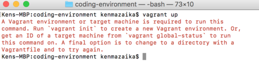

# Vagrant Error Message: A Vagrant environment is required to run this command. Run `vagrant init`

The error message that looks like the following is an error message that is common to run into.

## It is important that you **DO NOT RUN** the `vagrant init` command it tell you to.  That command will not fix your problem and will cause other problems if you run it.

Here is what you need to know about this specific error message.

## Why this happens

After running the `vagrant up` command this error message can happen on both Windows and Mac computers.  The reason this command will fail is that the folder you are running the command in requires that the folder you're running the command from includes a file named `Vagrantfile`.

This file needs to include the contents of the configuration was built specifically for this web development environment configuration.  If this does not include this, it won't work.

## How to fix this problem

**First**, open up a _Finder_ window if you're on a Mac or _Windows Explorer_ on Windows and navigate to your Desktop folder.  Inside your desktop there should be a folder called `coding-environment`.

Double click to navigate into that folder.

**If there is no `coding-environment` folder in your Desktop** — that is the problem.

You need to get the `coding-environment` folder on your desktop with the code for the environment in it.

[Download the coding-environment.zip] file and move it into the _Desktop_ on your computer.

**If there is a `vagrant` folder in your Desktop** — double click that vagrant folder in the _Finder_ or _Windows Explorer_ that you just opened.

Make sure that directly inside the `Desktop/coding-environment` folder there is a file called `Vagrantfile`.  If there is no `Vagrantfile` in there, delete the entire `coding-environment` folder that is on your Desktop, because it doesn't have the files you need it to.

[Download the coding-environment.zip] file and move it into the _Desktop_ on your computer.

**After that** — try a clean start of the section that suggested that you run `vagrant up`.

**First**, close out any command windows that are opened.

**Then**, open a fresh new command window to use.

**From that point**, follow all the steps in the install guide listed under **_"Starting Your Virtual Machine"_**.

> **Note**: make sure to run through each of the two steps the instructions tell you.  Keep in mind, there is one step that tells you to run a command with `cd`.  After that, there the instructions to run the `vagrant up` command.
>
> You will need to run both.

Once you run these commands again it should take a few moments and setup your Web Development environment.
