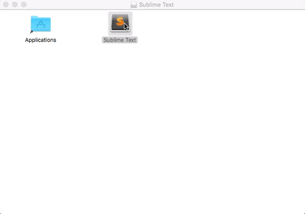
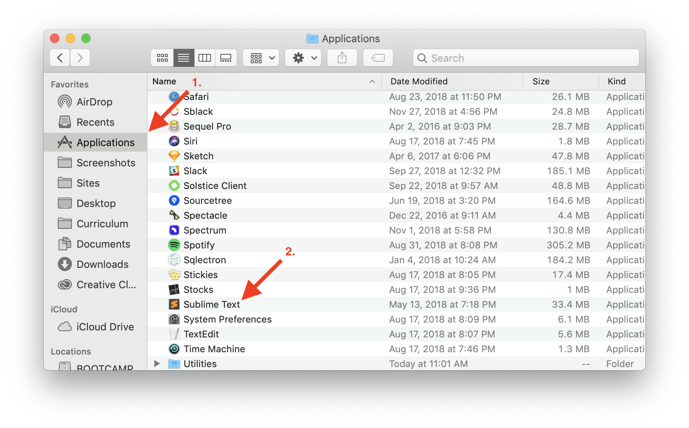
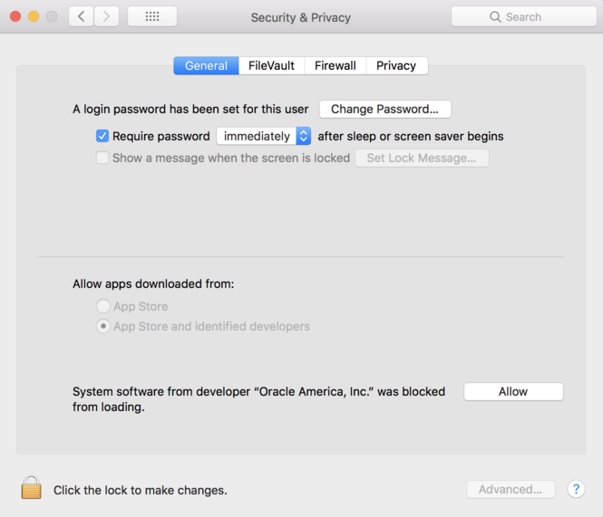
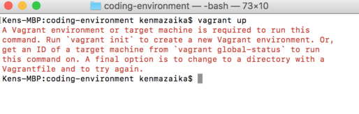

# Vagrant Web Development Setup for Macs

We will install, configure, and test your Vagrant web development environment. When you have completed this process, you will see a web application that is running from within this environment active inside your web browser.

Complete the following steps to install and use your Vagrant coding environment:

* [1. Get the files](#step-one-get-the-files)

* [2. Install Three Programs](#step-two-install-three-programs):

    * [Program 1: Sublime Text Editor](#program-one-sublime-text-editor)

    * [Program 2: VirtualBox](#program-two-virtualbox)

    * [Program 3: Vagrant](#program-three-vagrant)

* [3. Starting your virtual machine](#step-three-starting-your-virtual-machine)

    * [**Important**: Read this before running any additional commands](#important-read-this-before-running-any-additional-commands)

* [4. Log in to your dev environment](#step-four-log-into-your-dev-environment)

* [5. Connecting your environment with your accounts](#step-five-connecting-your-environment-with-your-accounts)

* [6. Test](#step-six-test)

* [7. Stop your rails server](#step-seven-stop-your-rails-server)

* [8. Learn about your Vagrant coding environment](#step-eight-learn-about-your-vagrant-coding-environment)

**Note:** Make sure to close other virtualization environments you have running. If you are running Parallels, VirtualBox, or VMWare you will need to close them.

## Step One: Get The Files

You will need a variety of files to set up your Vagrant virtual machine. Download and unzip [coding-environment.zip](tools/coding-environment.zip) to your Desktop folder.

The coding-environment folder will be the folder where your web development environment and source code will be used.

## Step Two: Install Three Programs

You will need to install Sublime Text, VirtualBox, and Vagrant to set up your coding environment.

### Program One: Sublime Text Editor

You might have Sublime already installed, but if you haven't installed it yet, complete the following steps:

1. Go to the [Sublime Text Editor website](http://sublimetext.com/) and click the Download for Mac button.

2. Double-click the downloaded file.

3. Drag the item into the *Applications* folder to install it. 

   

4. Open Sublime from your *Applications* folder.

   

**Note:** If you get an error because this program wasn't installed from the App Store (the error might [look like this](images/mac-vagrant-image_2.png)), do the following:

* Open Launchpad and go to System Preferences > Security & Privacy.

The Security & Privacy dialog opens.

* Click the [Open Anyway](images/mac-vagrant-image_3.png) button.

5. Go back to your *Applications* folder and reopen Sublime Text.

If you get a "Sublime Text is an application downloaded from the internet. Are you sure you want to open it?" warning message, click the "Open" button to open Sublime.

If you need more help installing Sublime, review the [Sublime Text install video](https://vimeo.com/88292868).

### Program Two VirtualBox

1. Go to the [VirtualBox website](https://www.virtualbox.org/wiki/Downloads), click the OS X hosts link.

2. Open the .dmg file that downloads, then double-click the VirtualBox.pkg icon that opens. The Install Oracle VM Virtual dialog opens.

3. Complete the steps in the dialogs to install VirtualBox.

4. When you have completed the installation, close the VirtualBox window.

**Note**: If you see an error message that says that you are not allowed to install programs from unidentified developers you will need to adjust your privacy settings to allow this.

To adjust your privacy settings, open *Launchpad* and select *Systems Preferences* > *Security & Privacy*.

Scroll down in the Security & Privacy dialog and find the section that says: *System software from developer "Oracle America, Inc." was blocked from loading *and click the Allow button finish the installation process of VirtualBox.

  

### Program Three: Vagrant

1. Go to the [Download Vagrant page](http://www.vagrantup.com/downloads.html), click Find the Mac OS X section and click Universal (32-bit and 64-bit).

2. Open the .dmg file you downloaded and complete the steps in the dialogs to install Vagrant.

3. Restart your computer if you're prompted to.

## Step Three: Starting Your Virtual Machine

The previous steps installed the three programs that are needed to use a Vagrant virtual machine. Now you are ready to turn the virtual environment.

Turning on your virtual environment for the first time will take a bit longer than usual.

Complete the following steps:

1. **Open the terminal** on your computer by pressing the Command+Spacebar keys to open Spotlight.

2. Type Terminal and press Enter.
The terminal window opens.

3. Run the following two commands in your terminal window:

   * Run the following command to change your working directory, to make it so you're working with the web development environment you downloaded earlier.

   `cd ~/Desktop/coding-environment`

Before running the next command to turn on your virtual computer environment, understand that the command will require you to download a file that is hundreds of MBs long. Make sure you are on a strong internet connection before you run this command.

Run the following command **after the command completes, read the next section before you run another command.**

`vagrant up`

### Important: Read This Before Running Any Additional Commands

The previous command may complete with a variety of messages. **It also may instruct you to run commands that will cause problems in your environment**: so make sure to read this section before running anymore commands.

**SUCCESS! Everything is successful.**

If everything is successful you will see output that looks like the following.


If your terminal shows something similar to the above then you can continue to **Step 4**. This means Vagrant has been installed and started as expected.

If this isn't what your screen looks like, continue with the instructions below.

The first thing you should do, is review the [ERROR] and [SOMETHING ELSE] messages to find the error that matches the error message you're seeing.

**[ERROR] — Vagrant environment or target machine error message shown.**

The error message will look like this:



The command may come back with an error message suggesting that you run the vagrant init command. **IMPORTANT!** **Do not run this command**.

**If you see this error**, [click here to understand and fix the problem so the vagrant up command works](faq/vagrant/run-vagrant-init.md)

**[ERROR] — vagrant up timeouts.**

Error messages indicating that:

Timed out while waiting for the machine to boot. This means Vagrant was unable to communicate with the guest machine within the configured ("config.vm.boot_timeout" value) time period.

This error message indicates that your computer was unable to connect to the Vagrant environment. This can happen if your computer is incompatible with Vagrant.

If you see this error message, try running the command an additional time to see if the command executes successfully the next time.

If you keep getting this error message, we recommend using a Cloud IDE. **[Click here to set up a Cloud IDE to use for your coding environment](cloud-ide.md)**.

**[SOMETHING ELSE] — the output produces something else and does not indicate that everything worked as expected.**

If you encountered an output that is different than the above actions your environment is in a state that is slightly different than these instructions expect. Because of this, you should ask your TA for help.

Use the following template when asking for help:

Hello. I'm setting up my web development environment using Vagrant and when running the vagrant up command I encountered an unusual problem. Attached is a screenshot of the error.

Then take a screenshot of the full output of the command you just ran in the terminal window and include it in your request for help. We will respond to your request for help as soon as possible!

## Step Four: Log Into Your Dev Environment

You have now installed, configured, and turned on a virtual computer to use for web development. The next step will log you in to your dev environment, so you can begin using it.

After vagrant up finishes running, do the following:

1. Enter the following command in your terminal window:

`vagrant ssh`

This command changes your regular terminal window into a terminal window that you can use to run commands inside the virtual computer that you have set up.

When you are logged into your virtual computer and it is ready for you to run commands inside this virtual machine your terminal will look like the following:


This logs you in to your web dev environment. You are now ready to run commands.

The terminal window with the green [ENV] text is a terminal window that is running inside your Vagrant virtual computer. We will refer to it as *your coding environment* from now on.

## Step Five: Connecting Your Environment With Your Accounts

In the previous steps, you set up GitHub and Heroku accounts. For these accounts to work correctly, you will need to connect your coding environment with these accounts.

Complete the steps in the [account setup guide](account-setup.md) to connect your environment to these accounts.

## Step Six: Test

Now that your environment is successfully installed, set up, and configured you can test that the environment is able to run a Ruby on Rails project.

To test your environment, complete the following steps:

1. Within your coding environment change your directory to the folder where the Ruby on Rails test application's source code is.

`cd /vagrant/src/rails-test-app`

2. Run the following command to start a Ruby on Rails server:

`rails s -b 0.0.0.0 -p 3000`

This command will start running and prevent you from running additional commands, but will allow you to interact with your application within a web browser.

**Note**: When the server finishes starting up, it may appear that it is hanging. The result will look like the following:


After your server finishes spinning up and the text that says User Ctrl-C to stop appears it means your server is running.

3. Open a web browser on your computer and go to: [http://127.0.0.1:3030](http://127.0.0.1:3030/).

You will be able to preview the application in your web browser and it will look like the following:


If you see this page, it means you've finished setting up your application and can preview an application that is running.

## Step Seven: Stop Your Rails Server

The command you ran above started running a server that can be previewed in a web browser. Before we finish, we should close the program we just opened.

To stop your rails server, complete the following:

1. Find your web development terminal where you ran the rails server (`rails s`) command and hold CTRL+C.

2. After you press CTRL+C on your keyboard, your terminal will give you a message that indicates your server has closed and return the following prompt so new commands can be entered:

```
^C- Gracefully stopping, waiting for requests to finish === puma shutdown: 2018-10-31 23:35:32 +0000 === 
Goodbye! Exiting
```

Running this command will prevent the webpage from loading in the future, but it will allow you to enter new commands.

## Step Eight: Learn About Your Vagrant Coding Environment

You have now set up a virtual machine with Vagrant on your computer. This will be your coding environment that you will be able to use for the remainder of the course.

Since you will be using this coding environment extensively in the future, understanding the environment is important.

[Visit the Introduction to Vagrant](cheat-sheets/vagrant-intro-mac.md) page to learn more about how to use this coding environment that you just set up.
