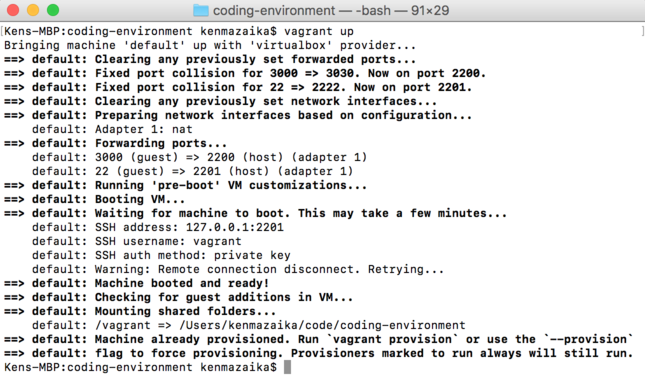
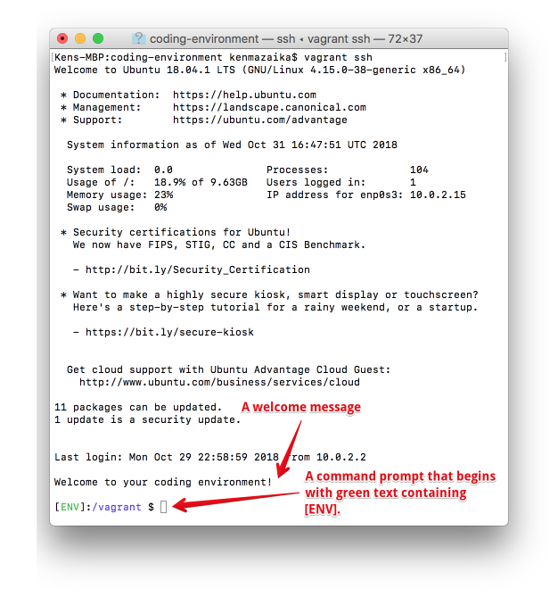

# Vagrant Web Development Setup for Apple Macintosh Computers

In this step, we will install, configure and test your vagrant web development environment.  At the end of this process, you will see a web application that is running from within this environment active inside your web browser.

> **Note:** Make sure to close any other virtualization environments you have running.  If you happen to be running Parallels, VirtualBox or VMWare for other reasons, you will need to close them.

Follow the following steps to install and use your vagrant environment.

## Step 1: Get the files

Your vagrant virtual machine will need a variety of files to set this up.

* **Download and unzip** [coding-environment.zip](https://github.com/university-bootcamp/coding-environment/raw/master/tools/coding-environment.zip) to your `Desktop` folder.

**Note:** _This folder will become the folder where your web development environment and source code will be used._

## Step 2: Install three programs

There are three programs you will need to install to setup your environment:  Sublime text, VirtualBox and vagrant.

### Program 1 — Sublime Text Editor

> You may have already installed this program, but if you haven't follow these steps.

**First**, visit the [Sublime Text Editor Website](http://sublimetext.com/) and click "Download for Mac".  

**Second**, open the file and [drag the Sublime Text program into the Applications folder](http://i.imgur.com/pgjF3WL.png), then launch the program by going into your _Launch Pad_ and finding "Sublime Text".  

> **Note:** When you follow this step, you may be presented with an error because this program wasn't installed from the App Store.  The error may [look like this](http://i.imgur.com/FNTYmyL.png).
> 
> If this happens do the following:
> * open Launch Pad 
> * navigate to `System Preferences > Security & Privacy`
> * Click the [Open Anyway](http://i.imgur.com/XPVpfRf.png) option.
> 
> If you see an error that _"Sublime Text" is an application downloaded from the internet. Are you sure you want to open it?_ [(screenshot)](http://i.imgur.com/bjtmqkw.png), press the **Open** button.  
> 
> This will launch the Sublime Text editor, and you'll be good.  
> 
> If you need more help check out [this Sublime Text install video](https://vimeo.com/88292868) that shows how to do this.

### Program 2 — VirtualBox

**First**, visit the [VirtualBox Website](https://www.virtualbox.org/wiki/Downloads), click the link to Download "OS X hosts".  

**Second**, Open the dmg file that downloads, then double click on VirtualBox.pkg that pops up and follow the instructions (you're clicking continue most of the time).  Once you go through that step close out the "VirtualBox" window.

### Program 3 — Vagrant

**First**, visit the [Vagrant Download Page](http://www.vagrantup.com/downloads.html), click Find the Mac OS X section and click "Universal (32 and 64-bit)".  Run the file you downloaded and follow the instructions (you're clicking next most of the time)

**Finally**, restart your computer if you're prompted to.

## Step 3: Starting Your Virtual Machine

The previous steps installed all the programs that were needed to use a vagrant virtual machine.  The next step will run through the steps of turning the environment on for the first time.

Turning on your virtual environment will take a bit longer than usual on the first time.

**Open the terminal** on your computer.  To do this, hold the `Command+Spacebar` keys to open the spotlight.  Then type `Terminal` and press the enter key.  This will open a terminal window.

You will need to run two commands in your terminal windows.

**First**, run the following command to change your working directory, to make it so you're working with the web development environment you downloaded earlier.

```
cd ~/Desktop/coding-environment
```

**Second**, you will need to run the command to turn on your virtual computer environment.

> **Note**:  this command will require you to download a file that is hundreds of megabytes long.  Make sure you are on a strong Internet connection before you run this command.

Run the following command — and **after the command completes, read the next section before you run another command.**

```
vagrant up
```

### IMPORTANT: Read this before running any additional commands.

The previous command may complete with a variety of messages.  **It also may instruct you to run commands that will cause problems in your environment**: so make sure to read this section before doing anything.

**[SUCCESS] — Everything is successful.**

If everything is successful you will see output that looks like the following.



If you see this, continue to **Step 4**: vagrant has been installed and started as expected.  If this isn't what your screen looks like, continue below and find the message that matches the output you're seeing.

**[ERROR] — `Vagrant environment or target machine` error message shown.**

The error message will look like this:


The command may come back with an error message suggesting that you run the `vagrant init` command. **Do not run this command**.

**If you see this error**, _**[click here to understand and fix the problem so the `vagrant up` command works](https://workspace.thefirehoseproject.com/comments/48)**_.

**[ERROR] — `vagrant up` timeouts.**

Error messages indicating that:

> Timed out while waiting for the machine to boot.  This means Vagrant was unable to communicate with the guest machine within th e configured ("config.vm.boot_timeout" value) time period.

This error message indicates that your computer was unable to connect to the vagrant environment.  This can happen if your computer is incompatible with vagrant.

When this error message happens it's often best to try to run the command an additional time to see if the command executes successfully the next time.

**Typically, we suggest switching to use a Cloud IDE if this problem persists.** **_[Click here to use a CloudIDE to use your coding environment](cloud-ide.md)_**.

**[SOMETHING ELSE] — the output produces something else and does not indicate that everything worked as expected.**

If you encountered an output that is different than the above actions your environment is in a state that is slightly different than these instructions expect.  Because of this, you should ask for help for a TA.

To get the best answer, use the following template to ask for help.

> Hello.  I'm setting up my web development environment using vagrant and when running the `vagrant up` command I encountered an unusual problem.  Attached is a screenshot of the error.

Then take a screenshot of the full output of the command you just ran in the terminal window and include it in your request for help.  We will get back to you about it, soon!

## Step 4: Log into your dev environment

The previous steps installed, configured and turned on a virtual computer that you can use for web development.  The next steps will log you into your environment, so you can begin using it.

After `vagrant up` finishes, enter the following command in the terminal window.

```
vagrant ssh
```

This command will change your regular terminal window into a terminal window that you can use to run commands inside the virtual computer that was setup.

> When you are logged into your virtual computer and it is ready for you to run commands inside this virtual machine your terminal will look like this.
> 
> 
> 
> This brings you into your web dev environment ready to run commands.


## Step 5: Connecting your environment with your accounts

In the previous steps you setup accounts on GitHub.com and heroku.com.  For these accounts to work correctly, you will need to connect your coding environment with these accounts.

### Step 5A: Generate SSH Key

An `SSH key` is a password file that exists on your computer.  First, we will need to generate a password file for our environment to use and we will do that in this section.  In the next part, we'll use this password file with our accounts.

> **Note:** The command that we are suggesting to run includes the backtick character, ```.  This is a different character than the single quote character, `'`.
> 
> Wither copy and paste the command below, or if you type it use the correct backtick character.  Usually, you can find this character on your keyboard on the key to the left of the 1 button.

This first command will run the command to turn on the SSH program in your environment.

*First*, run the following command in your virtual computer environment, the terminal window with the green `[ENV]` in the prompt.

```
eval `ssh-agent -s`
```

After the SSH agent begins running, run the following command to generate an SSH key (a password file) inside your coding environment.

**Next**, copy and paste the following command into the `[ENV]` terminal window.


```
ssh-keygen -t rsa -C "Firehose Vagrant" -N '' -f ~/.ssh/id_rsa
```

This file that was created needs to be registered on your computer.

**Finally**, copy and paste the following command into the `[ENV]` terminal window.

```
ssh-add ~/.ssh/id_rsa
```

This is everything you need to do to generate new SSH keys and have them setup in your coding environment.  Now we can use these SSH keys with the accounts you created.

### Step 5B: Configure heroku with SSH key

Your environment will need a heroku command line tool, the heroku `cli`, which will need to be installed.

**First**, copy and paste the following command to install this program into your coding environment.

```
wget -qO- https://cli-assets.heroku.com/install-ubuntu.sh | sh

```

Next, we will need to log into our heroku account in this coding environment.

> The next command will prompt you for the email address and password that you used when setting up your heroku account.

**Next**, run the following command and enter your email address and heroku password when prompted for it.

```
heroku login
```

This step logs your computer into your heroku account.  Connecting your heroku account with your SSH keys will make it so you won't have to manually log into heroku in the future when using it.

**Finally**, add your ssh key to your heroku account by running the following command in your coding enviroment.

```
heroku keys:add
```

This step will finalize the connection between your coding environment and the heroku service.

### Step 5C: Configure heroku with SSH key

Your environment will need to connect it's SSH key to the GitHub service, too.  We have written a script to help with this process.

> The command below will execute a script that we've written to automatically connect your GitHub account wit your SSH key.  
> 
> In this process, the program will prompt you for your GitHub username.  Keep in mind, this is your `username` for GitHub.com not your email address.

**Next**, copy and paste the following command in your coding enviroment.  After running this command, enter your GitHub username and password to connect your account.

```
curl https://gist.githubusercontent.com/kenmazaika/fa8ea7dfbae413638cfd111b974bc74a/raw/ecb5e91c044d92389d0cfd3c2229e57187384d6d/github_auth.rb  > ~/.firehose-github.rb && ruby ~/.firehose-github.rb
```

> **Important**:  After running the above command the command should display the text `ok!` in the terminal window.
>
> If it gives an error message, this usually indicates that you had problems when entering your username or password.  If this happens, try the above command again and enter your credentials another time.

#### Configure the git program

The above steps set git and GitHub to use your SSH key as a way to connect to your account.  There are also two configuration options you will need to provide git.

**Enter the following command in your web development environment**, and also be sure to adjust the email address in the command you execute to be your actual email address instead of the `you@example.com` address.

```
git config --global user.email "you@example.com"
```

**Enter the following command in your web development environment**, and also be sure to adjust the email address in the command you execute to be your name instead of the `Your Name` value.

```
git config --global user.name "Your Name"
```

After running these steps without error messages git will be setup and configured as expected in your coding environment.

## Step 6: Test

Now that your environment is properly installed, setup and configured you will now be able to test that the environment is able to run a ruby on rails project.  

**First**, within your coding environment change your directory to the folder where the Ruby on Rails test application's source code is.

```
cd /vagrant/src/rails-test-app
```

**Second**, run the following command to start a Ruby on Rails server.  This command will start running and prevent you from running additional commands, but will allow you to interact with your application within a web browser.

```
rails s -b 0.0.0.0 -p 3000
```

> **Important**: When the server finishes starting up, it may appear that it is hanging.  The result will look like this:
>
> 

After your server finishes spinning up and the text that says `User Ctrl-C to stop` appears it means your server is running.

**Third**, open a web browser on your computer and go to: [http://127.0.0.1:3030](http://127.0.0.1:3030).  You will be able to preview the application in your web browser and it will look like this.


If you see this, it means you've finished setting up your application and can preview an application that is running.

## Step 7: Stop your rails server

The command you ran above started running a server that can be previewed in a web browser.  Before we finish, we should close the program we just opened.

**Find your web development terminal where you ran the `rails server` (rails s) command and hold CTRL+C.**

After you press hold `CTRL+C` on your keyboard, your terminal will give you a message that indicates your server has closed and return the prompt so new commands can be entered.

> ^C- Gracefully stopping, waiting for requests to finish
> === puma shutdown: 2018-10-31 23:35:32 +0000 ===
> - Goodbye!
> Exiting

This will prevent the webpage from loading in the future, but will allow you to enter new commands.

## Step 8: Learn about your vagrant coding environment

By following these instructions in this guide you've setup a virtual machine with vagrant on your computer.  This will be your coding environment that you will be able to use for the remainder of the course.

Since you will be using this coding environment extensively in the future, understanding it will be important.

**_[Visit the the Introduction to Vagrant](https://online.bootcampspot.com/cheat-sheets/vagrant-windows)_** to learn more about how to use this development environment that you just setup.
