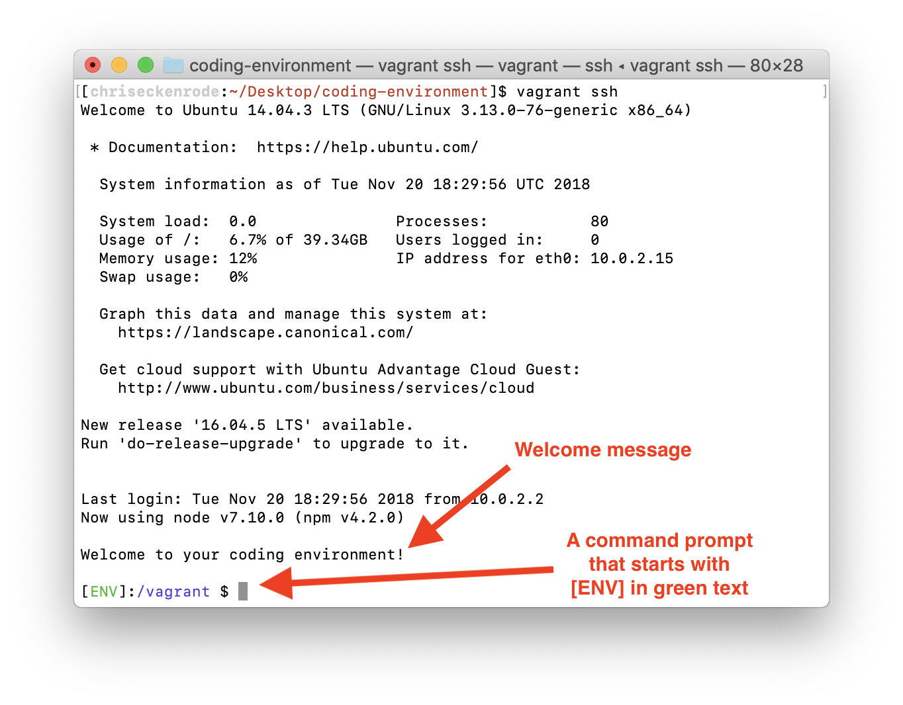

# Development Environment Setup (Macs)

A development environment refers to the set of processes and tools used to write computer software. This can encompass everything from the physical computer you’re working on to any software you have installed and configured to support development such as your code editor, Ruby, Rails, etc.

These instructions will guide you through configuring a web development environment on your machine as well as set up all the required accounts that you will need later in the course.

## Step One: Create Web Development Accounts

For now, you will need to create free accounts for the following services:

### GitHub

GitHub is a platform for hosting and sharing code. You’ll use GitHub to back up and showcase code you’ve worked on as well as collaborate on projects with other developers.

Go to [https://github.com/join](https://github.com/join) and sign up for a free account.

### Heroku

Heroku is a service that allows you to host your projects live on the internet.

Go to [https://signup.heroku.com/](https://signup.heroku.com/) and sign up for a free account.

### Amazon Web Services

Amazon Web Services provides web services that can plug into the web applications that you’re building. In this course, we will be using the **Amazon S3** storage service uploading and hosting images and videos.

Go to [https://portal.aws.amazon.com/billing/signup](https://portal.aws.amazon.com/billing/signup) and sign up for a free account.

You will need to enter a credit card to sign up, but AWS provides a free tier of services you’ll use throughout the course.

## Step Two: Set Up Vagrant

Vagrant is a program for building and managing virtual machine environments.

A virtual machine is a computer file that behaves like an actual computer. Functionally, a virtual machine is a self-contained operating system with its own file system and programs, but it runs inside a self-contained window, similar to other applications.

You’ll run many of the tools and applications needed for web development from within a Vagrant virtual machine. You’ll be provided a Vagrant Box, or configuration file, that can be used to quickly set up your virtual environment.

You could potentially install and configure all the required tools yourself locally without using a virtual machine, but some of these installations can be tricky to get working properly and can vary from one machine to another. To save time and ensure a stress-free and consistent experience, we recommend using Vagrant.

Click [here](mac-vagrant.md) to find the instructions for setting up Vagrant.

## Step Two: Set Up a Cloud IDE (Optional)

**If you have set up Vagrant successfully, skip this step. If you were unable to set Vagrant up on your machine, follow this step as a fallback.**

Sometimes, when trying to set up virtual computers on your machine problems will arise. At these times, it is often the best solution to use a cloud IDE.

Cloud IDEs give you a professional coding environment all within your web browser. There are a number of reasons to use cloud IDEs as follows:

* They can work regardless of the computer you're using if you can visit sites inside your web browser.

* They provide the flexibility to log in to your environment from different computers.

* Since everything will be accessed through a browser, they often can work with unusual internet, firewall, or restrictions from your ISP and router.

Because cloud IDEs give you the full power of a Linux virtual machine that is accessible within a web browser, they are a great option to set up a coding environment with too.

Click [here](cloud-ide.md) to use a cloud IDE as your development environment.

## Step Three: Understand Your Environment

By following the previous steps you should have installed a coding environment and verified that it’s working correctly. Since the different coding environments are each a little different depending on the choices you've made in the previous steps, following the lesson instructions could be a little different.

Here are the details that you will need to know about how to use the different coding environments when following through web development instruction materials.

### Vagrant

The following information is important for you to know about the installation process you just finished if you are using the Vagrant setup.

Between each of the coding sessions you do, especially if you restart your machine, you will need to run the following command to start your vagrant environment prior to connecting:

`vagrant up`

When this command completes, run the vagrant ssh command to log in to Vagrant.

After this completes, you will be taken to a coding environment inside your virtual machine, and the terminal should contain the green [ENV].

Before starting any new projects it can be helpful to restart Vagrant.

If you notice any Ruby on Rails servers that are still running in another terminal tab or window, you should quit those as you’ll get an error about multiple Rails instances attempting to use the same port.

Running the `killall ruby` command in your terminal should quit all running Rails servers if you’re unsure.

**To ensure that your server is not running** —- If you visit the URL [http://localhost:3030](http://localhost:3030) in your browser, you should not see a web page load. You should ensure that your server is not running before starting new server windows.

**If you want to preview the application that is running within your coding environment** -- Visiting the [http://localhost:3030](http://localhost:3030) from your web browser will allow you to do this.

**Location of project files** -— When using this vagrant environment, most people will store the code for their specific projects in the folder in the location /vagrant/src inside their coding environment.

All the files within this folder inside the Vagrant environment will be automatically synced outside the Vagrant environment to folder inside the coding-environment/src folder that is located outside the virtual machine, usually on your Desktop.

### Cloud IDE: Important Things to Know!

The following information will be important for you to know if you are using a cloud IDE setup.

**If you want to preview the application that is running within your coding environment** —- You will need to use the Run button provided in the browser environment. The IDE will provide you with a URL you can use to view your application.

**Note**: You'll need to follow [the instructions for setting up the run command](cloud-ide.md#step-3-setting-up-the-run-command) first.

**If you see instructions that tell you to visit the URL `localhost:3030` and you are using a cloud IDE** -— Instead you should make sure to follow the steps above to preview the web application in your coding environment.

**Location of project files** -— When using this coding environment, most people will store the code for their specific projects in the folder in the directly in the home folder of their environment.

**If you ever see instructions that suggest changing your directory or using the `/vagrant/src` folder** -— You should use the folder where your code lives instead. This will usually involve changing the directory to the home folder, using the `cd ~` command.

## Your Environment Setup Process Is Now Complete!

Your coding environment is now set up and you have the context of what you need to use it. You are now ready to begin building applications.
