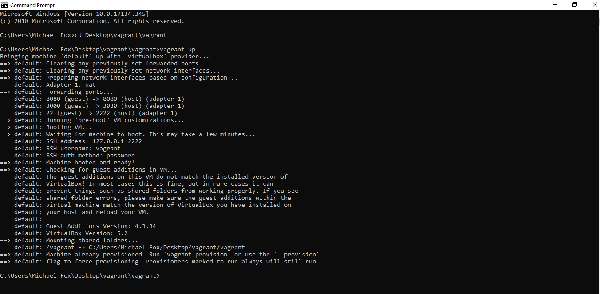
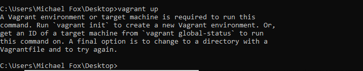

# Vagrant Web Development Setup for Apple Macintosh Computers

In this step, we will install, configure and test your vagrant web development environment.  At the end of this process, you will see a web application that is running from within this environment active inside your web browser.

- [Step 1: Get the files](#step-1-get-the-files)
- [Step 2: Install four programs](#step-2-install-four-programs)
  - [Program 1 — Sublime Text Editor](#program-1--sublime-text-editor)
  - [Program 2 — VirtualBox](#program-2--virtualbox)
  - [Program 3 — PuTTY](#program-3--putty)
  - [Program 4 — Vagrant](#program-4--vagrant)
- [Step 3: Starting Your Virtual Machine](#step-3-starting-your-virtual-machine)
  - [IMPORTANT: Read this before running any additional commands.](#important-read-this-before-running-any-additional-commands)
- [Step 4: Log into your dev environment](#step-4-log-into-your-dev-environment)
- [Step 5: Connecting your environment with your accounts](#step-5-connecting-your-environment-with-your-accounts)
- [Step 6: Test](#step-6-test)
- [Step 7: Stop your rails server](#step-7-stop-your-rails-server)
- [Step 8: Learn about your vagrant coding environment](#step-8-learn-about-your-vagrant-coding-environment)

> **Note:** Make sure to close any other virtualization environments you have running.  If you happen to be running Parallels, VirtualBox or VMWare for other reasons, you will need to close them.

Follow the following steps to install and use your vagrant environment.

## Step 1: Get the files

Your vagrant virtual machine will need a variety of files to set this up.

* **Download and unzip** [coding-environment.zip](https://github.com/university-bootcamp/coding-environment/raw/master/tools/coding-environment.zip) to your `Desktop` folder.

**Note:** _This folder will become the folder where your web development environment and source code will be used._

## Step 2: Install four programs

There are found programs you will need to install to setup your environment:  Sublime text, VirtualBox PuTTY and vagrant.

### Program 1 — Sublime Text Editor

> You may have already installed this program, but if you haven't follow these steps.

**First**, visit the [Sublime Text Editor Website](http://sublimetext.com/) and click "Download for Windows".  

**Second**, once the program finishes downloading, find the file in the Windows Exporer.  Right-click the program and select the `Run as Administrator` option.  Once this launches the installer, you can continue by pressing `Next` until the installer finishes.


### Program 2 — VirtualBox


**First**, visit the [VirtualBox Website](https://www.virtualbox.org/wiki/Downloads),  click the link to Download "Windows hosts".

**Second**, find the `VirutalBox.exe` program you just downloaded.  Right-click the program and select the `Run as Administrator` option.  Once this launches the installer, you can continue by pressing `Next` until the installer finishes.

> **Note:** if you are using the Windows 10 operating system, or later upgrade your operating system to Windows 10 it will be important to update your VirtualBox program to the latest release.

### Program 3 — PuTTY

**First**, visit the website to download the [PuTTY SSH Client](http://www.chiark.greenend.org.uk/~sgtatham/putty/latest.html). After downloading the executable, copy the `putty.exe` file onto your Desktop.

### Program 4 — Vagrant

* Go to the [Vagrant Download Page](http://www.vagrantup.com/downloads.html), click Find the Windows section and click "Universal (32 and 64-bit)".  Run the file you downloaded and follow the instructions (you're clicking next most of the time) and download the installer.

**First**, visit the [Vagrant Download Page](http://www.vagrantup.com/downloads.html), find and click the Windows selection.  Choose the selection for `Universal (32 and 64-bit)` programs and download the installer.

**Second**, find program you just downloaded.  Right-click the program and select the `Run as Administrator` option.  Once this launches the installer, you can continue by pressing `Next` until the installer finishes.

**Finally**, restart your computer if you're prompted to.

## Step 3: Starting Your Virtual Machine

The previous steps installed all the programs that were needed to use a vagrant virtual machine.  The next step will run through the steps of turning the environment on for the first time.

Turning on your virtual environment will take a bit longer than usual on the first time.

**Windows Command Prompt** on your computer.  To do this, hit the `Windows` key to open the search bar.  Then type `cmd.exe` and press the enter key.  This will open a command prompt window.


You will need to run two commands in your window.

**First**, run the following command to change your working directory, to make it so you're working with the web development environment you downloaded earlier.

```
cd Desktop\coding-environment
```

**Second**, you will need to run the command to turn on your virtual computer environment.

> **Note**:  this command will require you to download a file that is hundreds of megabytes long.  Make sure you are on a strong Internet connection before you run this command.

Run the following command — and **after the command completes, read the next section before you run another command.**

```
vagrant up
```

**NOTE:** If this comes back with an error message telling you to run `vagrant init` DO NOT DO THAT.  See this post [here](faq/vagrant/run-vagrant-init.md) for details about how to fix this error message.


### IMPORTANT: Read this before running any additional commands.

The previous command may complete with a variety of messages.  **It also may instruct you to run commands that will cause problems in your environment**: so make sure to read this section before doing anything.

**[SUCCESS] — Everything is successful.**

If everything is successful you will see output that looks like the following.



If you see this, continue to **Step 4**: vagrant has been installed and started as expected.  If this isn't what your screen looks like, continue below and find the message that matches the output you're seeing.

**[ERROR] — `Vagrant environment or target machine` error message shown.**

The error message will look like this:



The command may come back with an error message suggesting that you run the `vagrant init` command. **Do not run this command**.

**If you see this error**, _**[click here to understand and fix the problem so the `vagrant up` command works](faq/vagrant/run-vagrant-init.md)**_.


**[ERROR] — `vagrant up` timeouts.**

Error messages indicating that:

> Timed out while waiting for the machine to boot.  This means Vagrant was unable to communicate with the guest machine within th e configured ("config.vm.boot_timeout" value) time period.

This error message indicates that your computer was unable to connect to the vagrant environment.  This can happen if your computer is incompatible with vagrant.

When this error message happens it's often best to try to run the command an additional time to see if the command executes successfully the next time.

**Typically, we suggest switching to use a Cloud IDE if this problem persists.** **_[Click here to use a CloudIDE to use your coding environment](cloud-ide.md)_**.

**[SOMETHING ELSE] — the output produces something else and does not indicate that everything worked as expected.**

If you encountered an output that is different than the above actions your environment is in a state that is slightly different than these instructions expect.  Because of this, you should ask for help for a TA.

To get the best answer, use the following template to ask for help.

> Hello.  I'm setting up my web development environment using vagrant and when running the `vagrant up` command I encountered an unusual problem.  Attached is a screenshot of the error.

Then take a screenshot of the full output of the command you just ran in the terminal window and include it in your request for help.  We will get back to you about it, soon!

## Step 4: Log into your dev environment

The previous steps installed, configured and turned on a virtual computer that you can use for web development.  The next steps will log you into your environment, so you can begin using it.

After `vagrant up` finishes you will be able to connect to your environment using the `PuTTY` program you installed, earlier.

**First**, double-click the `putty.exe` program that is located on your _Desktop_.

**Second**, enter the relevant information about the connection in the program.

| **Field** | **Value**   |
| --------- | ----------- |
| Hostname  | `127.0.0.1` |
| Port      | `2222`      |

**Third**, press the `Open` button.

> **Note**: _You may be prompted with a PuTTY Security Alert asking if you trust the connection._
>
> 
>
> If this comes up press `Yes` to continue and stop prompting you with this warning.

> **Note:** after you press the `Open` button, you may see an error message appear that suggests the `Network Connection Refused`.
>
> If this happens, follow the instructions in **[`PuTTY Connection Refused` FAQ answer](faq/vagrant/putty-network-connection-refused.md)** to fix this.

**Fourth**, you will need to enter a login and password to log into your environment.  Enter the following values:

| **Field** | **Value** |
| --------- | --------- |
| Username  | `vagrant` |
| Password  | `vagrant` |


This command will change your regular terminal window into a terminal window that you can use to run commands inside the virtual computer that was setup.

When you are logged into your virtual computer and it is ready for you to run commands inside this virtual machine.

This brings you into your web dev environment ready to run commands.  This `PuTTY` window with the green `[ENV]` text is a terminal window that is running inside your vagrant virtual computer.  We will refer to as _your coding environment_ from now on.


## Step 5: Connecting your environment with your accounts

In the previous steps you setup accounts on GitHub.com and heroku.com.  For these accounts to work correctly, you will need to connect your coding environment with these accounts.

Follow the steps in the [account setup guide](account-setup.md) to hook up your environment to these accounts.

## Step 6: Test

Now that your environment is properly installed, setup and configured you will now be able to test that the environment is able to run a ruby on rails project.  

**First**, within your coding environment change your directory to the folder where the Ruby on Rails test application's source code is.

```
cd /vagrant/src/rails-test-app
```

**Second**, run the following command to start a Ruby on Rails server.  This command will start running and prevent you from running additional commands, but will allow you to interact with your application within a web browser.

```
rails s -b 0.0.0.0 -p 3000
```

> **Important**: When the server finishes starting up, it may appear that it is hanging.  The result will look like this:
>
> 

After your server finishes spinning up and the text that says `User Ctrl-C to stop` appears it means your server is running.

**Third**, open a web browser on your computer and go to: [http://127.0.0.1:3030](http://127.0.0.1:3030).  You will be able to preview the application in your web browser and it will look like this.


If you see this, it means you've finished setting up your application and can preview an application that is running.

## Step 7: Stop your rails server

The command you ran above started running a server that can be previewed in a web browser.  Before we finish, we should close the program we just opened.

**Find your web development terminal where you ran the `rails server` (rails s) command and hold CTRL+C.**

After you press hold `CTRL+C` on your keyboard, your terminal will give you a message that indicates your server has closed and return the prompt so new commands can be entered.

> ^C- Gracefully stopping, waiting for requests to finish
> === puma shutdown: 2018-10-31 23:35:32 +0000 ===
> - Goodbye!
> Exiting

This will prevent the webpage from loading in the future, but will allow you to enter new commands.

## Step 8: Learn about your vagrant coding environment

By following these instructions in this guide you've setup a virtual machine with vagrant on your computer.  This will be your coding environment that you will be able to use for the remainder of the course.

Since you will be using this coding environment extensively in the future, understanding it will be important.

**_[Visit the the Introduction to Vagrant](cheat-sheets/vagrant-intro-windows.md)_** to learn more about how to use this development environment that you just setup.
