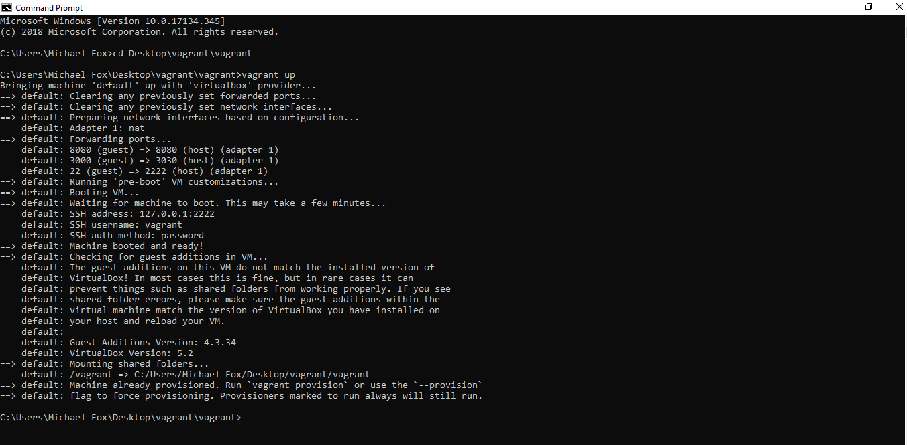
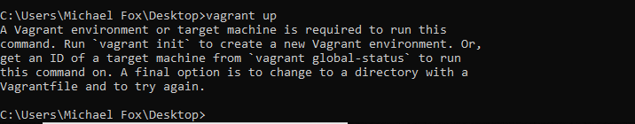
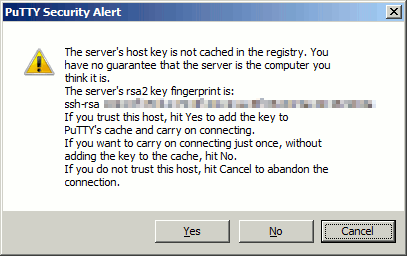
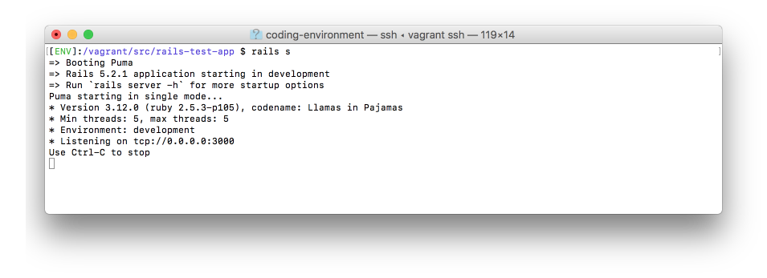

# Vagrant Web Development Setup for Windows

We will install, configure, and test your Vagrant web development environment. When you have completed this process, you will see a web application that is running from within this environment active inside your web browser.

Complete the following steps to install and use your Vagrant coding environment:

- [1. Get The Files](#step-one-get-the-files)

- [2. Install Four Programs](#step-two-install-four-programs):

  - [Program 1: Sublime Text Editor](#program-one-sublime-text-editor)

  - [Program 2: VirtualBox](#program-two-virtualbox)

  - [Program 3: PuTTY](#program-three-putty)

  - [Program 4: Vagrant](#program-four-vagrant)

- [3. Starting Your Virtual Machine](#step-three-starting-your-virtual-machine)

  - [**Important**: Read This Before Running Any Additional Commands](#important-read-this-before-running-any-additional-commands)

- [4. Log Into Your Dev Environment](#step-four-log-into-your-dev-environment)

- [5. Connecting Your Environment With Your Accounts](#step-five-connecting-your-environment-with-your-accounts)

- [6. Test](#step-six-test)

- [7. Stop Your Rails Server](#step-seven-stop-your-rails-server)

- [8. Learn About Your Vagrant Coding Environment](#step-eight-learn-about-your-vagrant-coding-environment)

> **Note:** Make sure to close any other virtualization environments you have running.  If you happen to be running Parallels, VirtualBox or VMWare for other reasons, you will need to close them.

Follow the following steps to install and use your vagrant environment.

## Important Check: Virtualization

For vagrant to function on your windows machine, you will need to make sure a feature called `virtualization` is enabled.

To find out if virtualization is enabled on your machine, please follow the steps below:

**First**, open your task manager (**ctrl** + **alt** + **del**).

**Second**, click on the **Performance** tab.


**If virtualization is not *Enabled*, you will not be able to use Vagrant on your machine and it's recommended that you use [Codenvy](windows.md#step-two-set-up-a-cloud-ide-alternative) as your development environment instead.**

It may be possible to enable virtualization from your machine's BIOS settings, though we're unable to provide specific instructions to accomplish this as every motherboard comes with a different BIOS interface. Additionally there's a high potential for causing damage to your computer from changing settings in the BIOS -- even if you do everything correctly.

Due to this, if virtualization is not enabled on your machine by default, we highly recommend that you use [Codenvy](windows.md#step-two-set-up-a-cloud-ide-alternative) instead. It's a great fully featured option that will allow you to access your development environment from any computer in the world with an internet connection.

If you feel confident updating your BIOS settings to enable virtualization, do so at your own risk, or discuss the option with your mentor. It's still recommended to get setup with [Codenvy](windows.md#step-two-set-up-a-cloud-ide-alternative) in the meantime so that you can begin working through the material.

**Do not proceed if virtualization is not enabled on your machine, use [Codenvy](windows.md#step-two-set-up-a-cloud-ide-alternative) instead.**

[Watch a video of Important Check: Virtualization](https://drive.google.com/open?id=1p3n5_WkCup8vrvhADaAcmhhMAj1SAztU)

## Step One: Get The Files

You will need a variety of files to set up your Vagrant virtual machine. Download and unzip [coding-environment.zip](tools/coding-environment.zip) to your Desktop folder.

**If you utilize any Cloud storage systems (such as OneDrive), you __must not__ unzip the Coding Environment to your Cloud Desktop. It must be unzipped to your true, local Desktop. If you have any questions, reach out to the TA Team.**

The coding-environment folder will be the folder where your web development environment and source code will be used.

[Watch a video of Step One: Get The Files](https://drive.google.com/open?id=1eWe0SFXZy1QBWissQGYqmqqdAM67mvGP)

## Step Two Install Four Programs

You will need to install Sublime Text, VirtualBox, PuTTY, and Vagrant to set up your coding environment.

### Program One: Sublime Text Editor

You might have Sublime already installed, but if you haven't installed it yet, complete the following steps:

1. Go to the [Sublime Text Editor website](http://sublimetext.com/) and click the Download for Windows button.

2. Go to your Downloads Folder, Right-click the file, and click `Run as Administrator`

3. Follow the installation prompt and click `Next` until it is finished.

If you need more help installing Sublime, review the [Sublime Text install video](https://vimeo.com/88292868).

### Program Two: VirtualBox

1. Go to the [VirtualBox website](https://www.virtualbox.org/wiki/Downloads), click the Windows hosts link.

2. Find the `VirutalBox.exe` program you just downloaded. Right-click the program and select the Run as Administrator option. Once this launches the installer, you can continue by pressing Next until the installer finishes.

3. Complete the steps in the dialogs to install VirtualBox.

4. When you have completed the installation, close the VirtualBox window.

Note: if you are using the Windows 10 operating system, or later upgrade your operating system to Windows 10 it will be important to update your VirtualBox program to the latest release.

### Program Three: PuTTY

1. Go to the website to download the [PuTTY SSH Client](http://www.chiark.greenend.org.uk/~sgtatham/putty/latest.html)

2. Copy the putty.exe file you download to your desktop

## Program Four: Vagrant

1. Go to the [Download Vagrant page](http://www.vagrantup.com/downloads.html), click Find the Windows section and click Universal (32 and 64-bit)

2. find program you just downloaded. Right-click the program and select the _Run as Administrator_ option. Once this launches the installer, you can continue by pressing _Next_ until the installer finishes.

3. Restart your computer if you're prompted to.

[Watch a video of Step Two Downloading Four Programs](https://drive.google.com/open?id=1KCQvKi5S7MjS0diuq9ovdwziRJnjYxH0)

[Watch a video of Step Two Installing Four Programs](https://drive.google.com/open?id=1wqet_mCb6DFU6J-acWCxO15-yDRHt0E6)


## Step Three: Starting Your Virtual Machine


The previous steps installed the four programs that are needed to use a Vagrant virtual machine. Now you are ready to turn the virtual environment.

Turning on your virtual environment for the first time will take a bit longer than usual.

Complete the following steps:

1. **Open Command Prompt** on your computer. To do this, hit the **_Windows_** key to open the search bar. Then type **_cmd.exe_** and press the enter key. This will open a command prompt window.

2. Run the following two commands in the Command Prompt:

   - Run the following command to change your working directory. This will make it so you're working with the web development environment you downloaded earlier.

   `cd Desktop\coding-environment`

   - Before running the command to turn on your virtual computer environment, understand that the next command will require you to download a file that is hundreds of MBs long. Make sure you are on a strong internet connection before you run this command.

Run the following command **after the previous command completes, read the next section before you run another command.**

`vagrant up`

### Important: Read This Before Running Any Additional Commands

The previous command may complete with a variety of messages. **It also may instruct you to run commands that will cause problems in your environment**: so make sure to read this section before running anymore commands.

**SUCCESS! Everything is successful.**

If everything is successful you will see output that looks like the following.



If your Command Prompt shows something similar to the above then you can continue to **Step 4**. This means Vagrant has been installed and started as expected.

If this isn't what your screen looks like, continue with the instructions below.

The first thing you should do, is review the [ERROR] and [SOMETHING ELSE] messages to find the error that matches the error message you're seeing.

**[ERROR] — Vagrant Environment Or Target Machine Error Message Shown.**

The error message will look like this:



The command may come back with an error message suggesting that you run the **_vagrant init_** command. **IMPORTANT!** **Do not run this command**.

**If you see this error, [click here to understand and fix the problem so the `vagrant up` command works](faq/vagrant/run-vagrant-init.md).**

**[ERROR] — vagrant up timeouts.**

Error messages indicating that:

Timed out while waiting for the machine to boot. This means Vagrant was unable to communicate with the guest machine within the configured ("config.vm.boot_timeout" value) time period.

This error message indicates that your computer was unable to connect to the Vagrant environment. This can happen if your computer is incompatible with Vagrant.

If you see this error message, try running the command an additional time to see if the command executes successfully the next time.

If you keep getting this error message, we recommend using a Cloud IDE. [**Click here to set up a Cloud IDE to use for your coding environment**](cloud-ide.md).

**[SOMETHING ELSE] — the output produces something else and does not indicate that everything worked as expected.**

If you encountered an output that is different than the above actions your environment is in a state that is slightly different than these instructions expect. Because of this, you should ask your TA for help.

Use the following template when asking for help:

_Hello. I'm setting up my web development environment using Vagrant and when running the **vagrant up** command I encountered an unusual problem. Attached is a screenshot of the error._

Then take a screenshot of the full output of the command you just ran in terminal the terminal window and include it in your request for help. We will respond to your request for help as soon as possible!

[Watch a video of Step Three: Starting Your Virtual Machine](https://drive.google.com/open?id=1fJbjq46QYYAPWvXVgF-91_N0C3c0CHxo)

## Step Four: Log Into Your Dev Environment

You have now installed, configured, and turned on a virtual computer to use for web development. The next step will log you in to your dev environment, so you can begin using it.

After **vagrant up** finishes you will be able to connect to your environment using the PuTTY program you installed, earlier.

1. Double-click the putty.exe program that is located on your Desktop.

2. Enter the relevant information about the connection in the program.

| Field    | Value     |
| -------- | --------- |
| Hostname | 127.0.0.1 |
| Port     | 2222      |

3. Press the "Open" button.

**Note**: _You may be prompted with a PuTTY Security Alert asking if you trust the connection._



If this comes up press Yes to continue and stop prompting you with this warning.

Note: after you press the Open button, you may see an error message appear that suggests the Network Connection Refused.

If this happens, follow the instructions in [PuTTY Connection Refused FAW Answer](faq/vagrant/putty-network-connection-refused.md) to fix this.

4. You will need to enter a login and password to log into your environment. Enter the following values:

| Field    | Value   |
| -------- | ------- |
| Username | vagrant |
| Password | vagrant |

This command will change your regular terminal window into a terminal window that you can use to run commands inside the virtual computer that was setup.

When you are logged into your virtual computer, it is ready for you to run commands inside this virtual machine.

This brings you into your web dev environment ready to run commands. This PuTTY window with the green [ENV] text is a terminal window that is running inside your vagrant virtual computer. We will refer to as _your coding environment_ from now on.

[Watch a video of Step Four: Log Into Your Dev Environment](https://drive.google.com/open?id=1xCJzVczNqRrvpVUEFKVb47Ks-hGZR39L)

## Step Five: Connecting Your Environment With Your Accounts

In the previous steps, you set up GitHub and Heroku accounts. For these accounts to work correctly, you will need to connect your coding environment with these accounts.

Complete the steps in the [account setup guide](account-setup.md) to connect your environment to these accounts.

## Step Six: Test

Now that your environment is successfully installed, set up, and configured you can test that the environment is able to run a Ruby on Rails project.

To test your environment, complete the following steps:

1. Within your coding environment change your directory to the folder where the Ruby on Rails test application's source code is.

`cd /vagrant/src/rails-test-app`

2. Run the following command to start a Ruby on Rails server:

`rails s`

This command will start running and prevent you from running additional commands, but will allow you to interact with your application within a web browser.

**Note**: When the server finishes starting up, it may appear that it is hanging. The result will look like the following:



After your server finishes spinning up and the text that says User Ctrl-C to stop appears it means your server is running.

3. Open a web browser on your computer and go to: [http://127.0.0.1:3030](http://127.0.0.1:3030/).

You will be able to preview the application in your web browser and it will look like the following:


If you see this page, it means you've finished setting up your application and can preview an application that is running.

## Step Seven: Stop Your Rails Server

The command you ran above started running a server that can be previewed in a web browser. Before we finish, we should close the program we just opened.

To stop your rails server, complete the following:

1. Find your web development terminal where you ran the rails server (`rails s`) command and press **CTRL+C**.

2. After you press **CTRL+C** on your keyboard, your terminal will give you a message that indicates your server has closed and return the following prompt so new commands can be entered:

```
^C- Gracefully stopping, waiting for requests to finish === puma shutdown: 2018-10-31 23:35:32 +0000 ===
Goodbye! Exiting
```

Running this command will prevent the webpage from loading in the future, but it will allow you to enter new commands.

## Step Eight: Learn About Your Vagrant Coding Environment

You have now set up a virtual machine with Vagrant on your computer. This will be your coding environment that you will be able to use for the remainder of the course.

Since you will be using this coding environment extensively in the future, understanding the environment is important.

[**Visit the Introduction to Vagrant**](cheat-sheets/vagrant-intro-windows.md) page to learn more about how to use this coding environment that you just set up.
